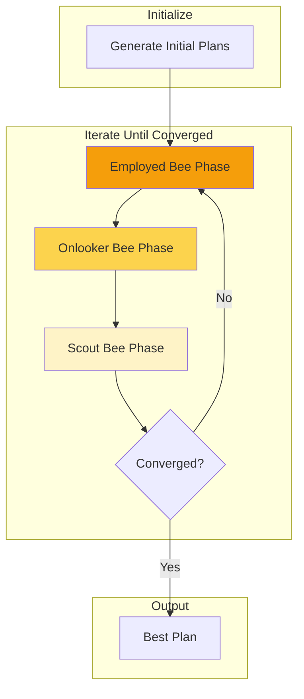
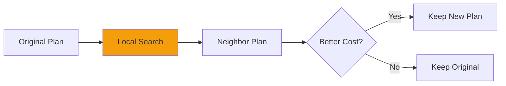

# ABC Query Optimization

How HiveFrame uses the Artificial Bee Colony algorithm to optimize SQL queries.

## The Optimization Problem

Query optimization is about finding the best execution plan for a SQL query. With multiple tables, joins, and filters, the number of possible plans grows exponentially:

```
10 tables → ~3.6 million possible join orders
```

Traditional optimizers use heuristics and dynamic programming. HiveFrame uses the **Artificial Bee Colony (ABC)** algorithm - a nature-inspired metaheuristic that excels at exploring large search spaces.

## ABC Algorithm Overview



## Phase 1: Initialization

Generate a diverse population of query plans:

```python
def initialize_plans(query, population_size=20):
    """Generate initial population of query plans."""
    plans = []
    
    for _ in range(population_size):
        plan = QueryPlan()
        
        # Randomize join order
        plan.join_order = random.shuffle(query.tables)
        
        # Randomize join types
        for join in query.joins:
            plan.join_types[join] = random.choice(["hash", "merge", "nested"])
        
        # Randomize which indexes to use
        plan.indexes = random.sample(available_indexes, k=random.randint(0, len(available_indexes)))
        
        # Calculate cost (fitness)
        plan.cost = estimate_cost(plan)
        plans.append(plan)
    
    return plans
```

## Phase 2: Employed Bee Phase

Each employed bee is assigned to one plan and tries to improve it:



```python
def employed_phase(plans):
    """Each employed bee improves its assigned plan."""
    
    for i, plan in enumerate(plans):
        # Generate neighbor by modifying one aspect
        neighbor = generate_neighbor(plan)
        
        # Greedy selection: keep if better
        if neighbor.cost < plan.cost:
            plans[i] = neighbor
            plans[i].trials = 0
        else:
            plans[i].trials += 1
    
    return plans
```

### Neighborhood Operations

```python
def generate_neighbor(plan):
    """Generate a neighboring plan by small modification."""
    
    neighbor = plan.copy()
    operation = random.choice([
        "swap_join_order",
        "change_join_type",
        "toggle_index",
        "change_scan_direction"
    ])
    
    if operation == "swap_join_order":
        # Swap two adjacent tables in join order
        i = random.randint(0, len(neighbor.join_order) - 2)
        neighbor.join_order[i], neighbor.join_order[i+1] = \
            neighbor.join_order[i+1], neighbor.join_order[i]
    
    elif operation == "change_join_type":
        # Change one join's implementation
        join = random.choice(list(neighbor.join_types.keys()))
        neighbor.join_types[join] = random.choice(["hash", "merge", "nested"])
    
    # ... other operations
    
    neighbor.cost = estimate_cost(neighbor)
    return neighbor
```

## Phase 3: Onlooker Bee Phase

Onlookers choose plans based on quality (inverse of cost) and help improve them:

```python
def onlooker_phase(plans):
    """Onlookers select and improve high-quality plans."""
    
    # Calculate selection probabilities (fitness-proportional)
    total_fitness = sum(1 / p.cost for p in plans)
    probabilities = [(1 / p.cost) / total_fitness for p in plans]
    
    for _ in range(len(plans)):
        # Select a plan with probability proportional to fitness
        selected_idx = roulette_wheel_selection(probabilities)
        selected = plans[selected_idx]
        
        # Try to improve it
        neighbor = generate_neighbor(selected)
        
        if neighbor.cost < selected.cost:
            plans[selected_idx] = neighbor
            plans[selected_idx].trials = 0
```

This phase **reinforces good solutions** - better plans get more improvement attempts.

## Phase 4: Scout Bee Phase

Scouts replace abandoned plans (those that haven't improved):

```python
def scout_phase(plans, max_trials=10):
    """Replace stagnant plans with new random ones."""
    
    for i, plan in enumerate(plans):
        if plan.trials > max_trials:
            # Abandoned! Generate new random plan
            plans[i] = generate_random_plan()
            plans[i].trials = 0
    
    return plans
```

Scouts ensure **exploration** - the algorithm doesn't get stuck in local optima.

## Cost Estimation

The cost model estimates execution time based on:

```python
def estimate_cost(plan):
    """Estimate the cost of executing a query plan."""
    
    cost = 0.0
    
    # Scan costs
    for table, scan_type in plan.scans.items():
        rows = table.estimated_rows
        if scan_type == "index":
            cost += rows * 0.01  # Fast random access
        else:
            cost += rows * 0.001  # Sequential scan
    
    # Join costs
    for join in plan.joins:
        left_rows = join.left.estimated_rows
        right_rows = join.right.estimated_rows
        
        if join.type == "hash":
            cost += left_rows + right_rows * 1.2
        elif join.type == "merge":
            cost += left_rows * math.log(left_rows) + right_rows * math.log(right_rows)
        elif join.type == "nested":
            cost += left_rows * right_rows * 0.001
    
    # Filter costs (predicate pushdown benefits)
    for filter in plan.filters:
        if filter.pushed_down:
            cost *= filter.selectivity  # Reduces downstream costs
    
    return cost
```

## Optimization Rules

HiveFrame applies these optimization rules during search:

| Rule | Description | Example |
|------|-------------|---------|
| Predicate Pushdown | Push filters to sources | `SELECT * FROM t WHERE x=1` → Filter at scan |
| Column Pruning | Read only needed columns | `SELECT a,b FROM t` → Skip columns c,d,e |
| Join Reordering | Optimize join sequence | Smallest tables first |
| Index Selection | Choose best indexes | Use index on filtered columns |
| Partition Pruning | Skip irrelevant partitions | `WHERE date='2026-01-30'` → Read one partition |

## Convergence

The algorithm converges when:

1. Best plan hasn't improved for N iterations
2. Maximum iterations reached
3. Cost drops below threshold

```python
def optimize(query, max_iterations=100, patience=10):
    """Main ABC optimization loop."""
    
    plans = initialize_plans(query)
    best = min(plans, key=lambda p: p.cost)
    no_improvement = 0
    
    for iteration in range(max_iterations):
        plans = employed_phase(plans)
        plans = onlooker_phase(plans)
        plans = scout_phase(plans)
        
        current_best = min(plans, key=lambda p: p.cost)
        
        if current_best.cost < best.cost:
            best = current_best
            no_improvement = 0
        else:
            no_improvement += 1
        
        if no_improvement >= patience:
            break
    
    return best
```

## Viewing Query Plans

```python
from hiveframe.sql import SQLContext

sql = SQLContext()

# Explain a query
plan = sql.explain("""
    SELECT d.name, SUM(s.amount)
    FROM sales s
    JOIN departments d ON s.dept_id = d.id
    WHERE s.date >= '2026-01-01'
    GROUP BY d.name
""")

print(plan)
```

Output:

```
== Logical Plan ==
Aggregate [name], [SUM(amount)]
  +- Join [dept_id = id]
       +- Filter [date >= '2026-01-01']
       |    +- Scan [sales]
       +- Scan [departments]

== Physical Plan ==
HashAggregate [name], [SUM(amount)]
  +- HashJoin [dept_id = id]
       +- IndexScan [sales] (idx_date)
       |    +- PushedFilter [date >= '2026-01-01']
       +- BroadcastScan [departments]

== ABC Optimization ==
Iterations: 23
Best Cost: 0.42
Rules Applied:
  ✓ Predicate Pushdown
  ✓ Index Selection (idx_date)
  ✓ Broadcast Join (departments < 10MB)
```

## See Also

- [Architecture Overview](./architecture-overview) - System design
- [Three-Tier Workers](./three-tier-workers) - Worker types
- [Reference: SQL](/docs/reference/sql) - SQL API reference
