# Architecture Overview

A high-level view of HiveFrame's architecture and how the components work together.

## System Architecture


## Core Components

### Colony

The Colony is the central coordination unit, analogous to a beehive. It manages:

- **Worker lifecycle** - Starting, stopping, and monitoring workers
- **Task distribution** - Assigning work to appropriate workers
- **Colony state** - Shared state for stigmergic coordination
- **Health monitoring** - Detecting and recovering from failures

```python
import hiveframe as hf

# Create a colony
colony = hf.Colony(
    name="my-colony",
    workers=8,           # Number of worker threads/processes
    coordinator="local"  # or "distributed" for cluster mode
)
```

### Worker Bees

Workers are the computational units that process data. HiveFrame uses a three-tier worker system:

| Worker Type | Role | Percentage | Behavior |
|-------------|------|------------|----------|
| **Employed** | Exploitation | ~50% | Process assigned tasks, report quality |
| **Onlooker** | Reinforcement | ~40% | Choose high-quality tasks based on dances |
| **Scout** | Exploration | ~10% | Search for new opportunities, recover abandoned tasks |

See [Three-Tier Workers](./three-tier-workers) for details.

### Waggle Dance Protocol

Workers communicate task quality through a virtual "waggle dance":

```mermaid
sequenceDiagram
    participant E as Employed Bee
    participant D as Dance Floor
    participant O as Onlooker Bee
    
    E->>E: Process food source
    E->>E: Calculate quality score
    E->>D: Perform waggle dance
    Note over D: Dance intensity ∝ quality
    O->>D: Observe dances
    O->>O: Choose based on probability
    O->>E: Follow to food source
```



See [Waggle Dance Protocol](./waggle-dance-protocol) for details.

### Query Optimizer

The ABC (Artificial Bee Colony) optimizer generates and evaluates query plans:


See [ABC Optimization](./abc-optimization) for details.

### Storage Layer

HiveFrame supports multiple storage formats:

| Format | Use Case | Features |
|--------|----------|----------|
| **Parquet** | Analytics | Columnar, compressed, predicate pushdown |
| **Delta Lake** | Lakehouse | ACID, time travel, schema evolution |
| **In-Memory** | Processing | Fast iteration, caching |

### Stream Processor

The streaming engine handles unbounded data with:

- **Windows** - Tumbling, sliding, session
- **Watermarks** - Late data handling
- **State management** - Checkpointing, recovery
- **Delivery guarantees** - At-most-once to exactly-once

## Data Flow

### Batch Processing


1. **Source** reads data (Parquet, database, etc.)
2. **Partitioner** distributes data to workers
3. **Workers** process partitions in parallel
4. **Collector** gathers results
5. **Destination** writes output

### Stream Processing


1. **Events** arrive continuously
2. **Watermark** tracks event-time progress
3. **Transform** applies map/filter operations
4. **Window** groups events by time
5. **Aggregate** computes results per window
6. **Sink** outputs results
7. **Checkpoint** saves state for recovery

## Deployment Models

### Local Mode

Single machine, multiple threads:

```python
colony = hf.Colony(name="local", coordinator="local")
```

### Cluster Mode

Distributed across machines:

```python
colony = hf.Colony(
    name="cluster",
    coordinator="distributed",
    coordinator_url="hiveframe://coordinator:5000"
)
```

### Kubernetes Mode

Managed by the HiveFrame Operator:

```yaml
apiVersion: hiveframe.io/v1
kind: HiveFrameCluster
metadata:
  name: production
spec:
  colony:
    name: prod-colony
  bees:
    employed:
      replicas: 10
```

## Key Design Principles

### 1. Decentralization

No single point of failure. Workers self-organize without a central driver.

### 2. Emergent Behavior

Complex system behavior emerges from simple worker rules:
- Report quality honestly
- Follow high-quality dances
- Abandon poor sources
- Explore when needed

### 3. Self-Healing

The colony automatically recovers from failures:
- Scout bees discover abandoned tasks
- Workers redistribute load
- Checkpoints enable recovery

### 4. Adaptive Resource Allocation

Resources flow to high-quality tasks:
- Better tasks attract more workers
- Poor tasks are abandoned
- System naturally load-balances

## Next Steps

- [Waggle Dance Protocol](./waggle-dance-protocol) - How workers communicate
- [Three-Tier Workers](./three-tier-workers) - Worker types and roles
- [ABC Optimization](./abc-optimization) - Query optimization algorithm
