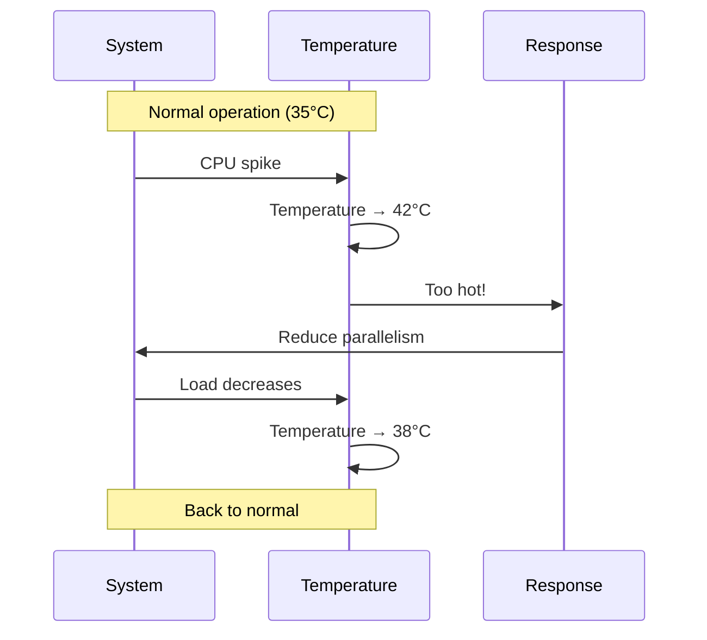

# Colony Temperature

How HiveFrame regulates system load through homeostasis.

## The Biological Inspiration

Real bee colonies maintain a precise hive temperature (~35°C) for brood development. They achieve this through collective behavior:

- **Too cold**: Bees cluster and vibrate muscles to generate heat
- **Too hot**: Bees fan wings and spread water droplets to cool
- **Just right**: Normal foraging activity continues

This **homeostatic regulation** maintains stability despite external changes.

## Colony Temperature in HiveFrame

HiveFrame uses "colony temperature" as a metaphor for system load:

```
Colony Temperature Scale
═══════════════════════════════════════════════════════
0°C                    30°C                   40°C                   50°C
├──────────────────────┼──────────────────────┼──────────────────────┤
│   COLD (underutil)   │      OPTIMAL         │    HOT (overload)    │
└──────────────────────┴──────────────────────┴──────────────────────┘
                              ▲
                           36°C (current)
```

| Temperature | State | System Behavior |
|-------------|-------|-----------------|
| < 30°C | Cold | Underutilized, increase work |
| 30-40°C | Optimal | Healthy, maintain |
| > 40°C | Hot | Overloaded, reduce work |

## How Temperature Is Calculated

```python
def calculate_colony_temperature(colony):
    """Calculate the colony's current temperature."""
    
    # CPU component
    cpu_temp = colony.cpu_utilization * 20  # 0-20 range
    
    # Memory component
    memory_temp = colony.memory_utilization * 15  # 0-15 range
    
    # Queue depth component
    queue_temp = min(colony.queue_depth / 1000, 1.0) * 10  # 0-10 range
    
    # Error rate component (heat from friction)
    error_temp = colony.error_rate * 5  # 0-5 range
    
    # Base temperature
    base_temp = 20
    
    return base_temp + cpu_temp + memory_temp + queue_temp + error_temp
```

## Homeostatic Response

### When Temperature Is Low (Underutilized)

```python
def warm_up(colony, temperature):
    """Increase activity when cold."""
    
    if temperature < 25:
        # Very cold: aggressive warmup
        colony.increase_parallelism(factor=2.0)
        colony.decrease_batch_interval(factor=0.5)
        
    elif temperature < 30:
        # Slightly cold: gentle warmup
        colony.increase_parallelism(factor=1.2)
```

Actions taken:
- Increase number of active workers
- Reduce batch intervals (process more frequently)
- Pre-fetch more data

### When Temperature Is High (Overloaded)

```python
def cool_down(colony, temperature):
    """Reduce activity when hot."""
    
    if temperature > 45:
        # Critical: aggressive cooling
        colony.decrease_parallelism(factor=0.5)
        colony.enable_backpressure()
        
    elif temperature > 40:
        # Hot: gentle cooling
        colony.decrease_parallelism(factor=0.8)
        colony.increase_batch_interval(factor=1.5)
```

Actions taken:
- Reduce number of active workers
- Increase batch intervals (process less frequently)
- Enable stronger backpressure
- Shed load if necessary

## Temperature Visualization



## Configuration

```python
colony = hf.Colony(
    name="my-colony",
    temperature_config={
        # Target range
        "target_min": 30,
        "target_max": 40,
        
        # Response thresholds
        "cold_threshold": 25,
        "hot_threshold": 45,
        "critical_threshold": 48,
        
        # Response aggressiveness
        "warmup_factor": 1.5,
        "cooldown_factor": 0.7,
        
        # Measurement interval
        "sample_interval_seconds": 5,
        
        # Smoothing (exponential moving average)
        "smoothing_factor": 0.3,
    }
)
```

## Monitoring Temperature

```python
# Get current temperature
temp = colony.get_temperature()
print(f"Colony temperature: {temp:.1f}°C")

# Get temperature history
history = colony.get_temperature_history(minutes=60)

# Subscribe to temperature changes
def on_temperature_change(old_temp, new_temp):
    if new_temp > 45:
        alert("Colony overheating!")

colony.on_temperature_change(on_temperature_change)
```

## Temperature Metrics

Expose temperature via Prometheus:

```python
from hiveframe.monitoring import enable_metrics

enable_metrics()

# Metrics exposed:
# hiveframe_colony_temperature (gauge)
# hiveframe_temperature_adjustments_total (counter)
# hiveframe_temperature_violations_total (counter)
```

Grafana alert example:

```yaml
alert: ColonyOverheating
expr: hiveframe_colony_temperature > 45
for: 2m
labels:
  severity: warning
annotations:
  summary: "Colony temperature is high"
```

## Benefits of Temperature-Based Regulation

1. **Self-stabilizing**: System finds its natural equilibrium
2. **Adaptive**: Responds to changing conditions
3. **Simple mental model**: Temperature metaphor is intuitive
4. **Holistic**: Considers multiple factors (CPU, memory, queues, errors)

## See Also

- [Pheromone Signaling](./pheromone-signaling) - Backpressure mechanism
- [Architecture Overview](./architecture-overview) - System design
- [How-To: Setup Monitoring](/docs/how-to/setup-monitoring) - Metrics setup
