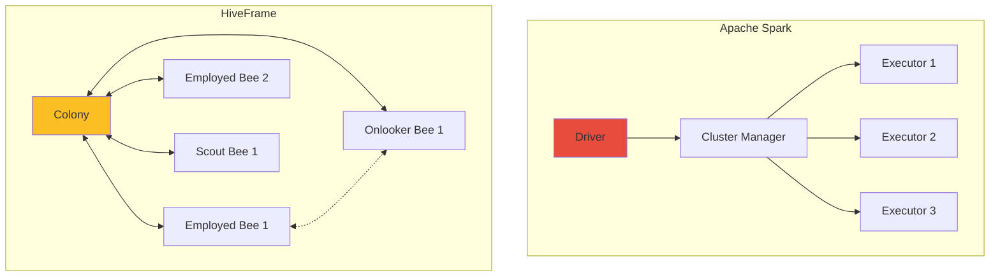

# Comparison with Apache Spark

How HiveFrame differs from Apache Spark and when to use each.

## Architecture Comparison



| Aspect | Apache Spark | HiveFrame |
|--------|-------------|-----------|
| **Coordination** | Centralized (Driver) | Decentralized (Colony) |
| **Task Assignment** | Driver assigns tasks | Workers self-organize |
| **Failure Handling** | Driver-coordinated | Self-healing (Scout bees) |
| **Load Balancing** | Static partitioning | Dynamic (Waggle dance) |

## Key Differences

### 1. No Single Point of Failure

**Spark**: If the driver fails, the entire job fails.

**HiveFrame**: If any component fails, the colony continues. Scout bees recover abandoned tasks.

### 2. Quality-Aware Scheduling

**Spark**: Tasks are assigned based on data locality and executor availability.

**HiveFrame**: Tasks are assigned based on quality scores. High-quality tasks (fast execution, good data) attract more workers through the waggle dance.

### 3. Adaptive Backpressure

**Spark**: Backpressure is reactive - triggers when executors are overwhelmed.

**HiveFrame**: Pheromone-based backpressure is proactive - signals propagate before buffers fill.

### 4. Continuous Optimization

**Spark**: Query plan is optimized once at compile time.

**HiveFrame**: ABC optimizer continuously searches for better plans during execution.

## API Comparison

### Creating DataFrames

```python
# Spark
from pyspark.sql import SparkSession
spark = SparkSession.builder.appName("MyApp").getOrCreate()
df = spark.read.parquet("data.parquet")

# HiveFrame
import hiveframe as hf
df = hf.read.parquet("data.parquet")
```

### Transformations

```python
# Spark
df.filter(df.age > 21).select("name", "email")

# HiveFrame (identical API)
df.filter(hf.col("age") > 21).select("name", "email")
```

### SQL

```python
# Spark
df.createOrReplaceTempView("users")
spark.sql("SELECT * FROM users WHERE age > 21")

# HiveFrame
sql = hf.SQLContext()
sql.register_table("users", df)
sql.execute("SELECT * FROM users WHERE age > 21")
```

### Streaming

```python
# Spark Structured Streaming
spark.readStream \
    .format("kafka") \
    .option("subscribe", "topic") \
    .load() \
    .groupBy(window("timestamp", "1 hour")) \
    .count() \
    .writeStream \
    .start()

# HiveFrame
stream = hf.StreamProcessor(config)
stream.from_source(KafkaSource(...)) \
    .window(TumblingWindow(3600)) \
    .groupBy("timestamp") \
    .agg(hf.count("*")) \
    .to_sink(...)
stream.start()
```

## Performance Characteristics

### Small Data (< 1GB)

| Metric | Spark | HiveFrame |
|--------|-------|-----------|
| Startup time | 5-30 seconds | < 1 second |
| Overhead | High (JVM, cluster) | Low (Python native) |
| Best for | Already running cluster | Quick analysis |

### Medium Data (1-100GB)

| Metric | Spark | HiveFrame |
|--------|-------|-----------|
| Throughput | High | High |
| Resource usage | Higher | Lower |
| Best for | Complex ETL | Streaming, dynamic loads |

### Large Data (> 100GB)

| Metric | Spark | HiveFrame |
|--------|-------|-----------|
| Scalability | Proven at PB scale | Designed for TB scale |
| Ecosystem | Mature | Growing |
| Best for | Enterprise data lakes | Targeted workloads |

## When to Use Each

### Choose Spark When:

- ✅ Processing petabyte-scale data lakes
- ✅ Need mature ML integration (MLlib)
- ✅ Organization already uses Spark
- ✅ Need exactly-once across complex pipelines
- ✅ Require graph processing (GraphX)

### Choose HiveFrame When:

- ✅ Need fast startup and low overhead
- ✅ Workloads are dynamic/unpredictable
- ✅ Want self-healing without manual intervention
- ✅ Prefer Python-native experience
- ✅ Running on Kubernetes
- ✅ Need quality-aware task distribution

## Migration Guide

### From Spark to HiveFrame

Most code translates directly:

```python
# Spark
df = spark.read.parquet("data/")
result = df.filter(col("status") == "active") \
    .groupBy("region") \
    .agg(sum("amount").alias("total"))
result.write.parquet("output/")

# HiveFrame (minimal changes)
df = hf.read.parquet("data/")
result = df.filter(hf.col("status") == "active") \
    .groupBy("region") \
    .agg(hf.sum("amount").alias("total"))
result.write.parquet("output/")
```

Key differences:
- Import `hiveframe as hf` instead of PySpark
- Use `hf.col()` instead of `col()`
- Use `hf.sum()`, `hf.count()` etc.
- SQL context creation differs

## Can They Coexist?

Yes! Use HiveFrame for:
- Real-time streaming dashboards
- Dynamic microservices
- Kubernetes-native deployments

Use Spark for:
- Large batch ETL jobs
- ML training pipelines
- Existing data lake queries

They can share the same storage (Parquet, Delta Lake).

## See Also

- [Architecture Overview](./architecture-overview) - HiveFrame architecture
- [Getting Started](/docs/tutorials/getting-started) - Start using HiveFrame
- [Reference: DataFrame](/docs/reference/dataframe) - DataFrame API
