# Pheromone Signaling

How HiveFrame implements backpressure and rate limiting using pheromone-based communication.

## The Biological Inspiration

In bee colonies, pheromones are chemical signals that coordinate behavior:

- **Alarm pheromones** alert the colony to danger
- **Trail pheromones** mark paths to food sources
- **Inhibitory pheromones** regulate population and activity

HiveFrame uses virtual pheromones for **flow control** - managing the rate of data processing to prevent overwhelm.

## The Backpressure Problem

Without backpressure, fast producers can overwhelm slow consumers:

```mermaid
flowchart LR
    subgraph Problem["Without Backpressure"]
        P1[Producer 1000/s] --> B[Buffer]
        B --> C[Consumer 100/s]
        B --> OOM[💥 Out of Memory!]
    end
```



## Pheromone-Based Solution

HiveFrame uses pheromone levels to signal congestion:


## How It Works

### 1. Pheromone Production

When buffers fill up, they "emit" pheromones:

```python
def calculate_pheromone_level(buffer):
    """Calculate pheromone level based on buffer fullness."""
    fullness = buffer.size / buffer.capacity
    
    # Non-linear response: ramp up pheromone at high fullness
    if fullness < 0.5:
        return fullness * 0.4  # Gentle increase
    elif fullness < 0.8:
        return 0.2 + (fullness - 0.5) * 1.0  # Moderate increase
    else:
        return 0.5 + (fullness - 0.8) * 2.5  # Rapid increase
```

### 2. Pheromone Diffusion

Pheromone signals propagate upstream through the processing pipeline:


```python
def propagate_pheromone(downstream_level, attenuation=0.9):
    """Propagate pheromone signal upstream with attenuation."""
    return downstream_level * attenuation
```

### 3. Worker Response

Workers adjust their behavior based on pheromone levels:

```python
def adjust_processing_rate(base_rate, pheromone_level):
    """Adjust processing rate based on pheromone signal."""
    
    if pheromone_level < 0.3:
        # Low congestion: speed up
        return base_rate * 1.5
    elif pheromone_level < 0.7:
        # Normal: maintain rate
        return base_rate
    elif pheromone_level < 0.9:
        # High congestion: slow down
        return base_rate * (1.0 - pheromone_level)
    else:
        # Critical: pause
        return 0
```

## Pheromone Types

HiveFrame uses different pheromone types for different signals:

| Pheromone | Trigger | Effect |
|-----------|---------|--------|
| **Congestion** | Buffer fullness | Slow down upstream |
| **Resource** | Memory/CPU usage | Reduce parallelism |
| **Error** | Failure rate | Trigger circuit breaker |
| **Quality** | Task completion | Attract more workers |

## Configuration

```python
colony = hf.Colony(
    name="my-colony",
    pheromone_config={
        # Thresholds
        "low_threshold": 0.3,
        "high_threshold": 0.8,
        "critical_threshold": 0.95,
        
        # Propagation
        "attenuation": 0.9,
        "decay_rate": 0.1,  # Per second
        
        # Response
        "slowdown_factor": 0.5,
        "speedup_factor": 1.5,
    }
)
```

## Monitoring Pheromones

```python
# Get current pheromone levels
levels = colony.get_pheromone_levels()

for component, level in levels.items():
    status = "🔴" if level > 0.8 else "🟡" if level > 0.3 else "🟢"
    print(f"{status} {component}: {level:.2f}")
```

Output:

```
🟢 source: 0.15
🟡 transform: 0.52
🔴 sink: 0.85
```

## Comparison with Traditional Backpressure

| Approach | Mechanism | Pros | Cons |
|----------|-----------|------|------|
| **Blocking** | Block producer | Simple | Can cause deadlocks |
| **Dropping** | Drop messages | Never blocks | Data loss |
| **Buffering** | Large buffers | Absorbs bursts | Memory usage |
| **Pheromone** | Adaptive rate | Self-regulating | Complexity |

Pheromone signaling combines the benefits:
- **Adaptive**: Responds to actual congestion
- **Distributed**: No central coordinator
- **Smooth**: Gradual rate changes
- **Self-healing**: Automatically recovers

## See Also

- [Colony Temperature](./colony-temperature) - Load regulation
- [Architecture Overview](./architecture-overview) - System design
- [Reference: Core](/docs/reference/core) - API reference
