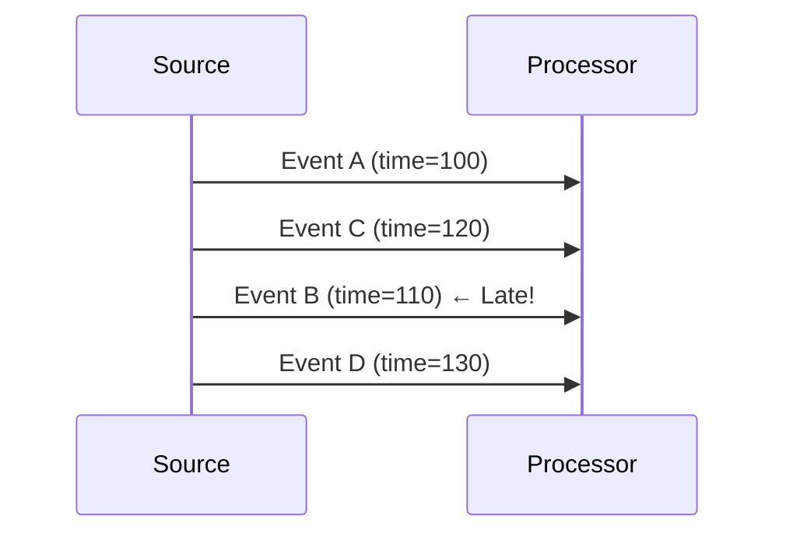
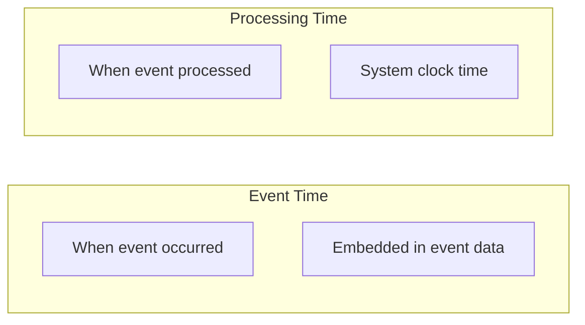
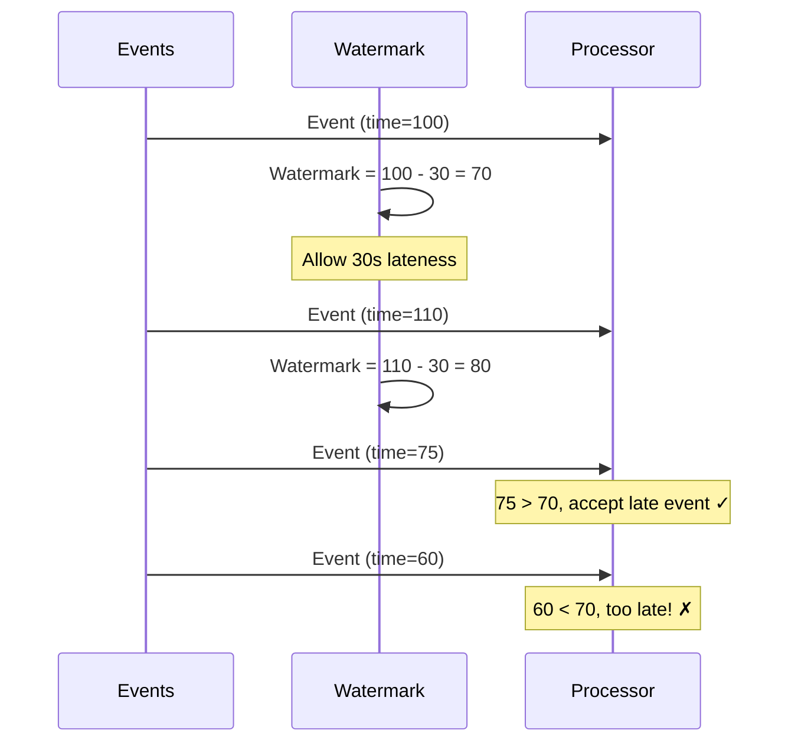
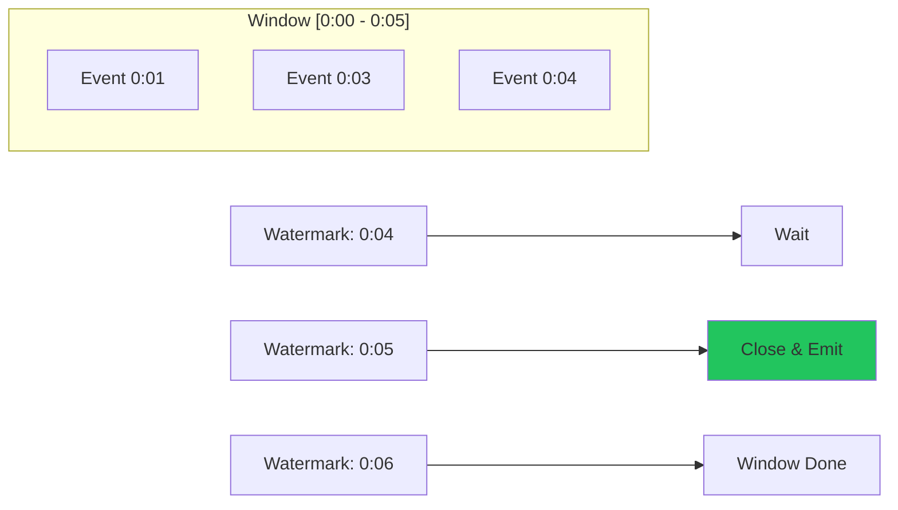

# Streaming Windows and Watermarks

Understanding time-based event processing in HiveFrame streaming.

## The Time Problem

In streaming, events can arrive out of order:



How do we handle this? When can we close a window and emit results?

## Event Time vs Processing Time



| Aspect | Event Time | Processing Time |
|--------|------------|-----------------|
| Source | Event timestamp field | System clock |
| Ordering | May be out of order | Always ordered |
| Accuracy | Reflects reality | Reflects processing |
| Use case | Analytics, billing | Monitoring, alerts |

HiveFrame primarily uses **event time** for accurate analytics.

## Window Types

### Tumbling Windows

Non-overlapping, fixed-size windows:

```mermaid
gantt
    title Tumbling Window (5 min)
    dateFormat HH:mm
    axisFormat %H:%M
    
    section Windows
    Window 1 :00:00, 5m
    Window 2 :00:05, 5m
    Window 3 :00:10, 5m
```



```python
from hiveframe.streaming import TumblingWindow

stream.window(TumblingWindow(duration_seconds=300))  # 5 minutes
```

**Use when:** You need non-overlapping time periods (hourly aggregations, daily reports).

### Sliding Windows

Overlapping windows that "slide" forward:

```mermaid
gantt
    title Sliding Window (5 min window, 1 min slide)
    dateFormat HH:mm
    axisFormat %H:%M
    
    section Windows
    Window 1 :00:00, 5m
    Window 2 :00:01, 5m
    Window 3 :00:02, 5m
    Window 4 :00:03, 5m
```



```python
from hiveframe.streaming import SlidingWindow

stream.window(SlidingWindow(
    duration_seconds=300,  # 5 minute window
    slide_seconds=60       # Slide every 1 minute
))
```

**Use when:** You need moving averages or trends (last 5 minutes, updated every minute).

### Session Windows

Dynamic windows based on activity gaps:

```mermaid
gantt
    title Session Window (2 min gap)
    dateFormat HH:mm
    axisFormat %H:%M
    
    section User A
    Session 1 :00:00, 3m
    Gap :00:03, 2m
    Session 2 :00:05, 4m
    
    section User B
    Session 1 :00:01, 7m
```



```python
from hiveframe.streaming import SessionWindow

stream.window(SessionWindow(gap_seconds=120))  # 2 minute gap
```

**Use when:** Analyzing user sessions, activity bursts, or variable-length sequences.

## Watermarks

Watermarks track the progress of event time and handle late data:



### Watermark Definition

```
Watermark(t) = max(event_times) - threshold
```

```python
from hiveframe.streaming import Watermark

stream.with_watermark(
    Watermark(
        event_time_column="timestamp",
        delay_threshold_seconds=30
    )
)
```

### How Watermarks Trigger Windows

Windows are closed when the watermark passes their end time:



## Late Data Handling

### Drop Late Events

```python
stream.with_watermark(
    Watermark(
        event_time_column="timestamp",
        delay_threshold_seconds=30,
        late_data_policy="drop"
    )
)
```

### Allowed Lateness

Allow late updates to already-emitted windows:

```python
stream.with_watermark(
    Watermark(
        event_time_column="timestamp",
        delay_threshold_seconds=30,
        allowed_lateness_seconds=3600  # Accept 1 hour late
    )
)
```

This emits:
1. Initial result when window closes (watermark passes)
2. Updated results as late data arrives
3. Final result when allowed lateness expires

### Side Output for Late Data

```python
stream.with_watermark(
    Watermark(
        event_time_column="timestamp",
        delay_threshold_seconds=30,
        late_data_output="late_events"
    )
)

# Process late data separately
late_stream = stream.get_side_output("late_events")
late_stream.to_sink(late_data_sink)
```

## Putting It Together

```python
from hiveframe.streaming import (
    StreamProcessor,
    StreamConfig,
    TumblingWindow,
    Watermark,
    DeliveryGuarantee,
)

stream = StreamProcessor(StreamConfig(
    name="clickstream-analytics",
    delivery=DeliveryGuarantee.EXACTLY_ONCE,
))

(
    stream
    # Handle late data (up to 5 minutes)
    .with_watermark(
        Watermark(
            event_time_column="click_time",
            delay_threshold_seconds=300
        )
    )
    # 1-hour tumbling windows
    .window(TumblingWindow(duration_seconds=3600))
    # Aggregate clicks by page
    .groupBy("page_url")
    .agg(
        hf.count("*").alias("clicks"),
        hf.count_distinct("user_id").alias("unique_users"),
        hf.window_start().alias("hour_start"),
        hf.window_end().alias("hour_end"),
    )
    .to_sink(results_sink)
)
```

## Choosing Parameters

### Window Size

| Window Size | Use Case | Trade-off |
|-------------|----------|-----------|
| Seconds | Real-time monitoring | High output volume |
| Minutes | Operational dashboards | Balanced |
| Hours | Business reporting | Delayed insights |

### Watermark Delay

| Delay | Use Case | Trade-off |
|-------|----------|-----------|
| Low (seconds) | Strict real-time | May drop late data |
| Medium (minutes) | Most applications | Balanced |
| High (hours) | Complete data | High latency |

Consider your data's lateness characteristics:
- Network delays
- Mobile devices going offline
- Batch uploads

## Monitoring

```python
# Get window statistics
stats = stream.get_window_stats()

print(f"Open windows: {stats.open_count}")
print(f"Late events: {stats.late_count}")
print(f"Current watermark: {stats.watermark}")
```

## See Also

- [How-To: Configure Windows](/docs/how-to/configure-windows) - Practical setup
- [How-To: Manage Watermarks](/docs/how-to/manage-watermarks) - Late data handling
- [Tutorial: Streaming](/docs/tutorials/streaming-application) - Full tutorial
