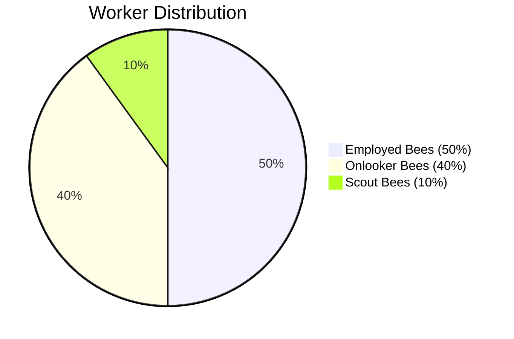
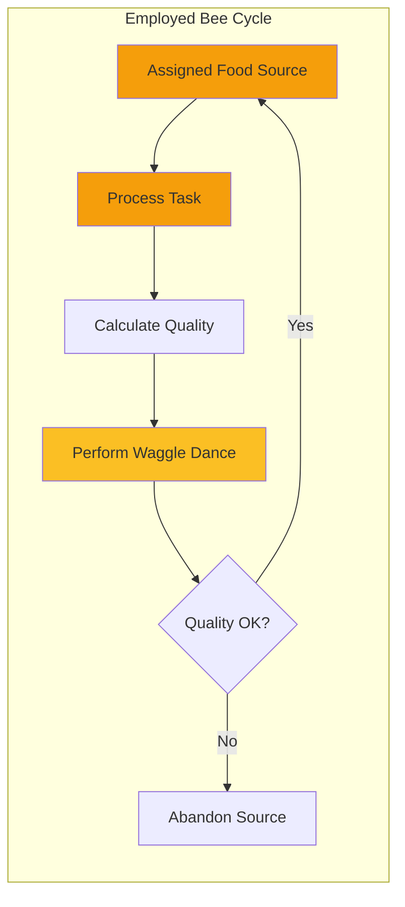
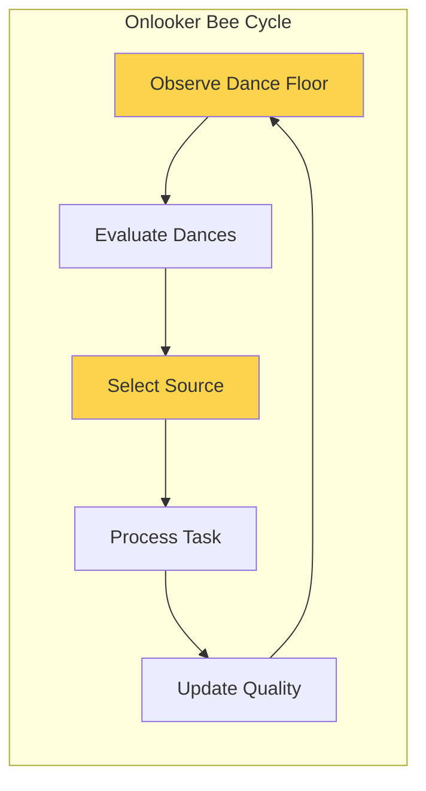
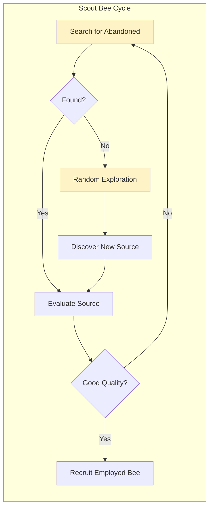
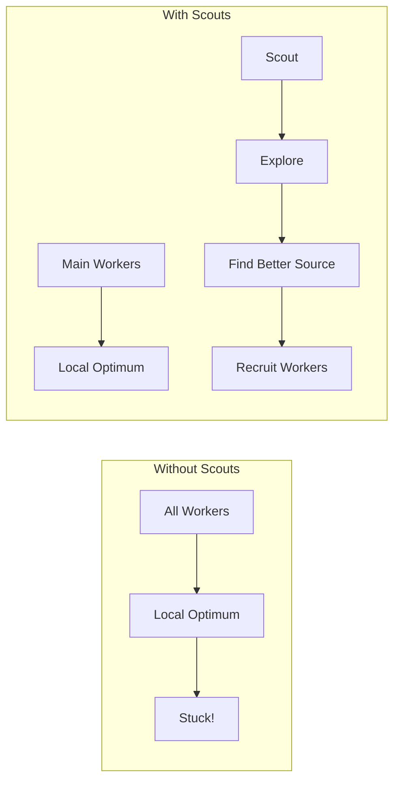
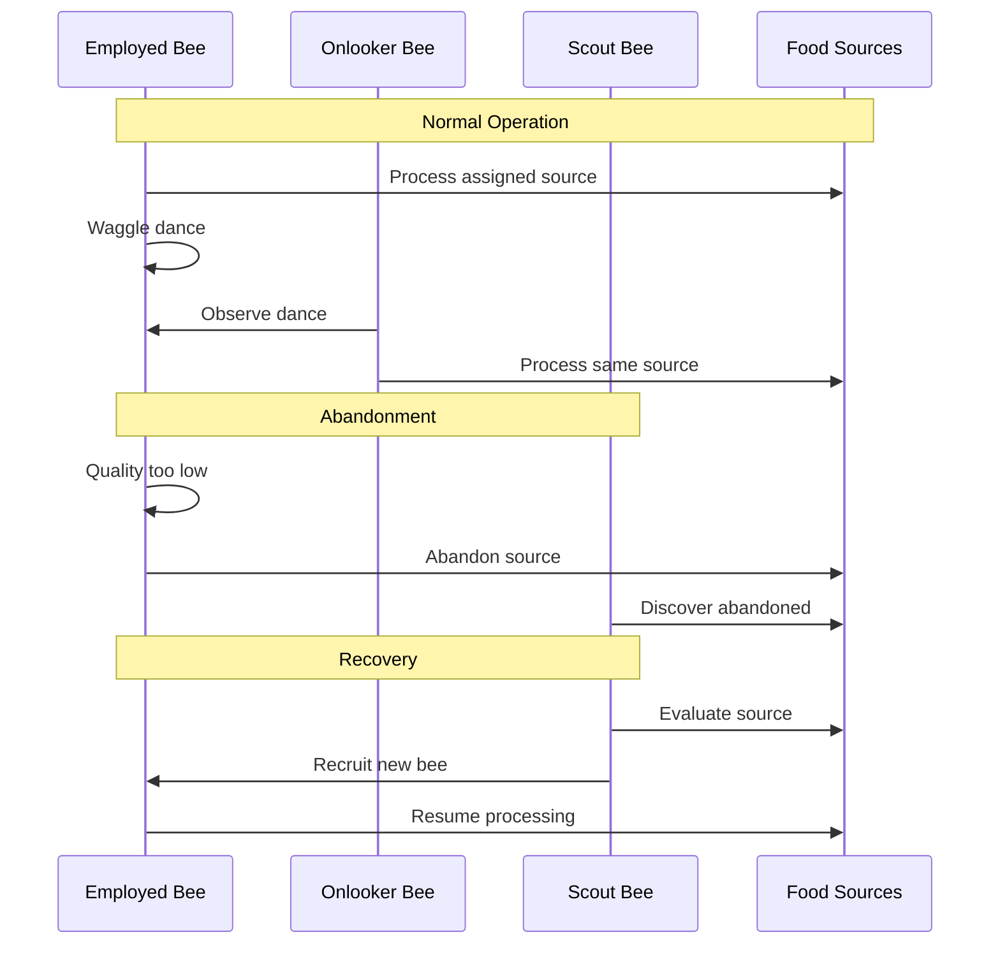

# Three-Tier Worker System

Understanding HiveFrame's employed, onlooker, and scout bees.

## Overview

HiveFrame uses a three-tier worker system inspired by real bee colonies:



Each tier has a distinct role that contributes to efficient, self-organizing data processing.

## Employed Bees (Exploitation)

**Role**: Process assigned tasks and report quality through waggle dances.



### Behavior

1. Each employed bee is assigned to exactly one food source (task/partition)
2. Process the task and collect metrics
3. Calculate a quality score
4. Perform a waggle dance proportional to quality
5. If quality drops below threshold, abandon the source

### Configuration

```python
colony = hf.Colony(
    name="my-colony",
    employed_config={
        "count": 10,  # Number of employed bees
        "abandonment_threshold": 0.3,  # Quality below which to abandon
        "max_trials": 5,  # Attempts before abandonment
    }
)
```

## Onlooker Bees (Reinforcement)

**Role**: Choose high-quality tasks based on waggle dances and help process them.



### Behavior

1. Watch the waggle dances of employed bees
2. Select a food source with probability proportional to dance intensity
3. Process the same source as the selected employed bee
4. Update the quality score if different
5. Return to observe more dances

### Selection Algorithm

```python
def onlooker_select(dances):
    """Roulette wheel selection based on dance quality."""
    
    # Calculate probabilities
    total = sum(d.quality for d in dances)
    probs = [d.quality / total for d in dances]
    
    # Weighted random selection
    return random.choices(dances, weights=probs, k=1)[0]
```

This creates a natural **reinforcement** effect where good tasks get more workers.

### Configuration

```python
colony = hf.Colony(
    name="my-colony",
    onlooker_config={
        "count": 8,  # Number of onlooker bees
        "selection_strategy": "roulette",  # or "tournament"
    }
)
```

## Scout Bees (Exploration)

**Role**: Search for new opportunities and recover abandoned food sources.



### Behavior

1. Search for food sources that were abandoned by employed bees
2. Evaluate the quality of discovered/abandoned sources
3. If quality is acceptable, recruit an employed bee to the source
4. Randomly explore for new food sources
5. Report discoveries back to the colony

### Why Scouts Matter

Scouts solve the **local optima problem**:



Without scouts, the colony might get stuck exploiting suboptimal sources. Scouts ensure continuous exploration of the solution space.

### Configuration

```python
colony = hf.Colony(
    name="my-colony",
    scout_config={
        "count": 2,  # Number of scout bees
        "exploration_radius": 0.5,  # How far to explore
        "recruitment_threshold": 0.5,  # Quality needed to recruit
    }
)
```

## Worker Interaction

The three tiers work together in a continuous cycle:



## Balancing Exploitation and Exploration

The ratio of worker types controls the **exploitation-exploration tradeoff**:

| Configuration | Exploitation | Exploration | Use Case |
|---------------|--------------|-------------|----------|
| More Employed | High | Low | Stable, predictable workloads |
| More Onlooker | High | Medium | Quality-sensitive tasks |
| More Scout | Medium | High | Dynamic, changing workloads |

### Default Balance

The default 50-40-10 split is based on research in bee colony optimization:

- **50% Employed**: Ensures each source has dedicated workers
- **40% Onlooker**: Provides strong reinforcement for good sources
- **10% Scout**: Maintains exploration without wasting resources

## Monitoring Workers

```python
# Get worker statistics
stats = colony.get_worker_stats()

print(f"Employed: {stats.employed_count} active")
print(f"Onlooker: {stats.onlooker_count} active")
print(f"Scout: {stats.scout_count} active")
print(f"Abandoned sources: {stats.abandoned_count}")
print(f"Recovered sources: {stats.recovered_count}")
```

## Adaptive Ratios

HiveFrame can automatically adjust worker ratios based on workload:

```python
colony = hf.Colony(
    name="my-colony",
    adaptive_workers=True,
    worker_bounds={
        "employed_min": 0.4,
        "employed_max": 0.6,
        "scout_min": 0.05,
        "scout_max": 0.2,
    }
)
```

When many sources are being abandoned, the system increases scouts. When sources are stable, it increases employed bees.

## See Also

- [Waggle Dance Protocol](./waggle-dance-protocol) - How workers communicate
- [ABC Optimization](./abc-optimization) - The underlying algorithm
- [Architecture Overview](./architecture-overview) - System design
