# Waggle Dance Protocol

How HiveFrame workers communicate task quality through a virtual "waggle dance."

## The Biological Inspiration

In real bee colonies, forager bees perform a waggle dance to communicate the location and quality of food sources to their hive mates:

- **Duration** indicates distance to the source
- **Angle** indicates direction relative to the sun
- **Vigor** indicates source quality (more waggling = better food)

Other bees watch these dances and decide which sources to visit based on the enthusiasm of the dancing bee.

## The Software Implementation

HiveFrame implements a virtual waggle dance protocol for task distribution:


## Quality Scoring

Each task (food source) gets a quality score based on multiple factors:

```python
def calculate_quality(task_result):
    """Calculate the quality score for a completed task."""
    
    # Base metrics
    throughput = task_result.records_processed / task_result.duration
    success_rate = 1.0 - (task_result.errors / task_result.total)
    
    # Resource efficiency
    memory_efficiency = 1.0 - (task_result.memory_used / task_result.memory_limit)
    cpu_efficiency = task_result.cpu_utilized / task_result.cpu_allocated
    
    # Weighted combination
    quality = (
        0.4 * normalize(throughput) +
        0.3 * success_rate +
        0.2 * memory_efficiency +
        0.1 * cpu_efficiency
    )
    
    return quality  # 0.0 to 1.0
```

## Dance Intensity

The dance intensity (how enthusiastically a bee "dances") is proportional to quality:

```mermaid
graph LR
    subgraph Quality Scores
        Q1[Quality: 0.9]
        Q2[Quality: 0.6]
        Q3[Quality: 0.3]
    end
    
    subgraph Dance Intensity
        D1[Intense waggle 🔥]
        D2[Moderate waggle]
        D3[Weak waggle]
    end
    
    subgraph Selection Probability
        P1[~50% chosen]
        P2[~33% chosen]
        P3[~17% chosen]
    end
    
    Q1 --> D1 --> P1
    Q2 --> D2 --> P2
    Q3 --> D3 --> P3
    
    style Q1 fill:#22c55e
    style Q2 fill:#eab308
    style Q3 fill:#ef4444
```



Higher quality tasks get more "dance time," attracting more onlooker bees.

## Selection Mechanism

Onlooker bees use **roulette wheel selection** to choose which dance to follow:

```python
def select_food_source(dances):
    """Select a food source based on dance quality."""
    
    # Calculate selection probabilities
    total_quality = sum(d.quality for d in dances)
    probabilities = [d.quality / total_quality for d in dances]
    
    # Roulette wheel selection
    r = random.random()
    cumulative = 0.0
    
    for dance, prob in zip(dances, probabilities):
        cumulative += prob
        if r <= cumulative:
            return dance.food_source
    
    return dances[-1].food_source
```

This creates a **probability-proportional** selection where better tasks are more likely to be chosen, but not deterministically.

## Dance Floor Implementation

The dance floor is a shared registry where workers publish and observe dances:

```python
class DanceFloor:
    """Shared registry for waggle dance communications."""
    
    def __init__(self):
        self.dances = {}  # source_id -> Dance
        self.lock = threading.Lock()
    
    def register_dance(self, source_id, quality, worker_id):
        """Employed bee registers a dance after processing."""
        with self.lock:
            self.dances[source_id] = Dance(
                source_id=source_id,
                quality=quality,
                worker_id=worker_id,
                timestamp=time.time()
            )
    
    def observe_dances(self):
        """Onlooker bee observes all current dances."""
        with self.lock:
            return list(self.dances.values())
    
    def remove_dance(self, source_id):
        """Remove dance when source is abandoned."""
        with self.lock:
            self.dances.pop(source_id, None)
```

## Benefits of Waggle Dance Distribution

### 1. Quality-Weighted Allocation

Resources naturally flow to the best tasks:


### 2. No Central Scheduler

Workers make independent decisions based on observed dances. This eliminates:
- Single point of failure
- Scheduling bottleneck
- Complex coordination logic

### 3. Adaptive Load Balancing

The system continuously adapts to changing conditions:
- New high-quality tasks attract workers quickly
- Degrading tasks lose workers gradually
- No explicit rebalancing needed

### 4. Emergent Intelligence

Complex scheduling behavior emerges from simple rules:
1. Process your assigned task
2. Report quality honestly
3. Follow high-quality dances
4. Abandon poor sources

## Tuning Parameters

| Parameter | Default | Description |
|-----------|---------|-------------|
| `dance_decay` | 0.95 | How quickly old dances lose influence |
| `exploration_rate` | 0.1 | Probability of ignoring dances (exploration) |
| `quality_threshold` | 0.3 | Minimum quality to keep dancing |
| `max_dances` | 100 | Maximum concurrent dances |

```python
colony = hf.Colony(
    name="my-colony",
    dance_config={
        "dance_decay": 0.95,
        "exploration_rate": 0.1,
        "quality_threshold": 0.3,
    }
)
```

## Observing Dances

Monitor the dance floor for debugging and optimization:

```python
# Get current dances
dances = colony.get_dances()

for dance in dances:
    print(f"Source: {dance.source_id}")
    print(f"  Quality: {dance.quality:.2f}")
    print(f"  Worker: {dance.worker_id}")
    print(f"  Age: {time.time() - dance.timestamp:.1f}s")
```

## See Also

- [Three-Tier Workers](./three-tier-workers) - Worker types and their roles
- [Architecture Overview](./architecture-overview) - System architecture
- [Pheromone Signaling](./pheromone-signaling) - Backpressure mechanism
