# Configure Streaming Windows

Set up tumbling, sliding, and session windows for stream aggregations.

## Tumbling Windows

Non-overlapping, fixed-size windows:

```python
from hiveframe.streaming import TumblingWindow

# 1-minute windows
stream.window(TumblingWindow(duration_seconds=60))

# With time zone
stream.window(TumblingWindow(
    duration_seconds=3600,  # 1 hour
    timezone="America/New_York"
))
```



```mermaid
gantt
    title Tumbling Window (1 min)
    dateFormat X
    axisFormat %s
    
    section Windows
    Window 1 :0, 60
    Window 2 :60, 120
    Window 3 :120, 180
```

## Sliding Windows

Overlapping windows with configurable slide:

```python
from hiveframe.streaming import SlidingWindow

# 10-second window, sliding every 5 seconds
stream.window(SlidingWindow(
    duration_seconds=10,
    slide_seconds=5
))
```



```mermaid
gantt
    title Sliding Window (10s window, 5s slide)
    dateFormat X
    axisFormat %s
    
    section Windows
    Window 1 :0, 10
    Window 2 :5, 15
    Window 3 :10, 20
    Window 4 :15, 25
```

## Session Windows

Dynamic windows based on activity gaps:

```python
from hiveframe.streaming import SessionWindow

# New session after 5 minutes of inactivity
stream.window(SessionWindow(gap_seconds=300))
```

## Window Operations

```python
# Basic aggregation
stream.window(TumblingWindow(60)).agg(
    hf.count("*").alias("count"),
    hf.sum("amount").alias("total")
)

# Group by key within window
stream.window(TumblingWindow(60)).groupBy("user_id").agg(
    hf.sum("amount").alias("user_total")
)

# Include window bounds in output
stream.window(TumblingWindow(60)).agg(
    hf.window_start().alias("window_start"),
    hf.window_end().alias("window_end"),
    hf.count("*").alias("count")
)
```

## Late Data Handling

```python
from hiveframe.streaming import TumblingWindow, Watermark

stream.with_watermark(
    Watermark(
        event_time_column="timestamp",
        delay_threshold_seconds=30  # Allow 30s late data
    )
).window(
    TumblingWindow(duration_seconds=60)
).agg(...)
```

## See Also

- [Manage Watermarks](./manage-watermarks) - Late data handling
- [Delivery Guarantees](./delivery-guarantees) - Processing semantics
- [Tutorial: Streaming](../tutorials/streaming-application) - Full tutorial
