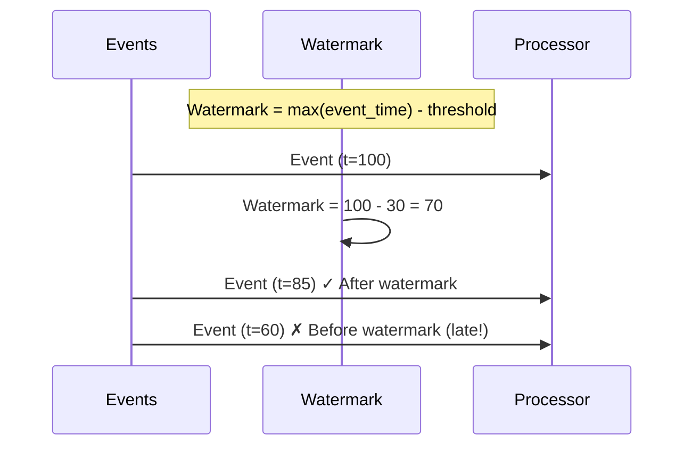

# Manage Watermarks

Handle late-arriving data in streaming applications.

## What Are Watermarks?

Watermarks track event-time progress and determine when to close windows:



## Basic Configuration

```python
from hiveframe.streaming import Watermark

stream.with_watermark(
    Watermark(
        event_time_column="timestamp",
        delay_threshold_seconds=30
    )
)
```

## Watermark Strategies

### Fixed Delay

```python
# Always 30 seconds behind max event time
stream.with_watermark(
    Watermark(
        event_time_column="timestamp",
        delay_threshold_seconds=30,
        strategy="fixed"
    )
)
```

### Bounded Out-of-Orderness

```python
# Allows events up to 1 minute out of order
stream.with_watermark(
    Watermark(
        event_time_column="timestamp",
        max_out_of_orderness_seconds=60,
        strategy="bounded"
    )
)
```

### Periodic (Custom)

```python
def custom_watermark(events, current_watermark):
    max_time = max(e["timestamp"] for e in events)
    return max_time - timedelta(seconds=30)

stream.with_watermark(
    Watermark(
        event_time_column="timestamp",
        generator=custom_watermark,
        strategy="custom"
    )
)
```

## Handle Late Data

### Drop Late Events

```python
stream.with_watermark(
    Watermark(
        event_time_column="timestamp",
        delay_threshold_seconds=30,
        late_data_policy="drop"  # Default
    )
)
```

### Send to DLQ

```python
from hiveframe.dlq import DeadLetterQueue

dlq = DeadLetterQueue(DLQConfig(path="data/late_events"))

stream.with_watermark(
    Watermark(
        event_time_column="timestamp",
        delay_threshold_seconds=30,
        late_data_policy="dlq",
        late_data_sink=dlq
    )
)
```

### Emit to Side Output

```python
late_stream = stream.get_late_data_stream()

# Process late data separately
late_stream.to_sink(late_data_sink)
```

### Allow Late Updates

```python
# Allow updates to windows for late data
stream.with_watermark(
    Watermark(
        event_time_column="timestamp",
        delay_threshold_seconds=30,
        allowed_lateness_seconds=3600  # Accept 1 hour late
    )
)
```

## Monitor Watermark Progress

```python
stream.with_watermark(
    Watermark(
        event_time_column="timestamp",
        delay_threshold_seconds=30,
        on_watermark_advance=lambda w: print(f"Watermark: {w}"),
        on_late_data=lambda e: print(f"Late event: {e}")
    )
)
```

## Best Practices

1. **Set threshold based on expected lateness** in your data
2. **Monitor late data rate** - high rates may indicate threshold too low
3. **Consider source characteristics** - network delays, batch uploads
4. **Use bounded out-of-orderness** for variable delay patterns

## See Also

- [Configure Windows](./configure-windows) - Window types
- [Delivery Guarantees](./delivery-guarantees) - Processing semantics
- [Explanation: Streaming](/docs/explanation/streaming-windows-watermarks) - Deep dive
