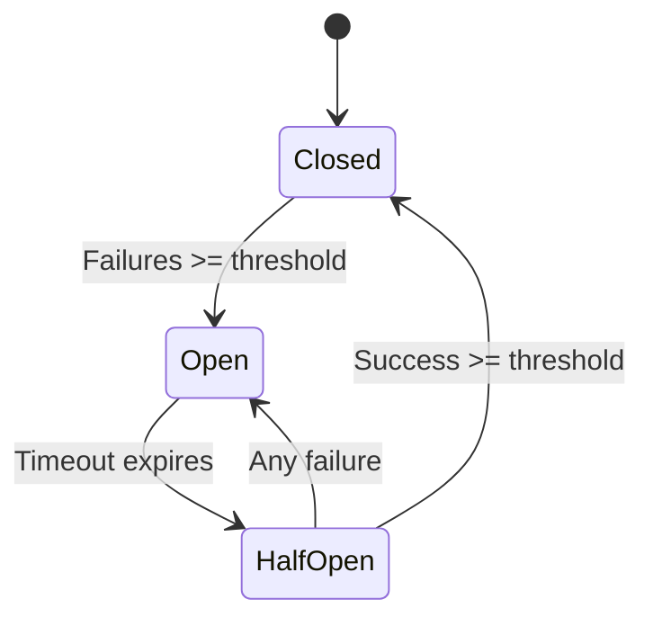

# Use Circuit Breaker

Prevent cascade failures by stopping calls to failing services.

## Basic Circuit Breaker

```python
from hiveframe.resilience import CircuitBreaker, CircuitBreakerConfig

config = CircuitBreakerConfig(
    failure_threshold=5,      # Open after 5 failures
    success_threshold=3,      # Close after 3 successes
    timeout_seconds=30,       # Stay open for 30 seconds
)

cb = CircuitBreaker(config)

@cb
def call_external_service():
    return requests.get("https://api.example.com/data")
```

## Circuit States



| State | Behavior |
|-------|----------|
| **Closed** | Normal operation, calls pass through |
| **Open** | All calls fail immediately (fast fail) |
| **Half-Open** | Allow limited calls to test recovery |

## Configuration Options

```python
config = CircuitBreakerConfig(
    # When to open
    failure_threshold=5,
    failure_rate_threshold=0.5,   # Or 50% failure rate
    minimum_calls=10,             # Minimum calls before rate check
    
    # How long to stay open
    timeout_seconds=30,
    
    # When to close
    success_threshold=3,
    
    # What counts as failure
    failure_exceptions=[
        ConnectionError,
        TimeoutError,
        requests.exceptions.RequestException,
    ],
    
    # Exclude certain exceptions
    ignore_exceptions=[
        ValueError,  # Don't count as failure
    ],
)
```

## Monitor Circuit State

```python
cb = CircuitBreaker(config)

# Check current state
print(f"State: {cb.state}")  # CLOSED, OPEN, or HALF_OPEN
print(f"Failure count: {cb.failure_count}")
print(f"Success count: {cb.success_count}")

# State change callbacks
def on_state_change(old_state, new_state):
    print(f"Circuit breaker: {old_state} -> {new_state}")
    if new_state == "OPEN":
        alert("Service degraded!")

cb.on_state_change(on_state_change)
```

## Manual Control

```python
cb = CircuitBreaker(config)

# Force open (for maintenance)
cb.open()

# Force close (after fixing issue)
cb.close()

# Reset counters
cb.reset()
```

## With Fallback

```python
from hiveframe.resilience import CircuitBreaker, Fallback

cb = CircuitBreaker(config)

@cb
@Fallback(lambda: {"status": "cached", "data": get_cached_data()})
def call_service():
    return requests.get("https://api.example.com/data").json()

# When circuit is open or call fails, returns fallback
result = call_service()
```

## Async Support

```python
from hiveframe.resilience import AsyncCircuitBreaker

cb = AsyncCircuitBreaker(config)

@cb
async def call_service_async():
    async with aiohttp.ClientSession() as session:
        async with session.get("https://api.example.com") as resp:
            return await resp.json()
```

## Multiple Services

```python
# Separate circuit breaker per service
payment_cb = CircuitBreaker(config, name="payment-service")
inventory_cb = CircuitBreaker(config, name="inventory-service")
shipping_cb = CircuitBreaker(config, name="shipping-service")

@payment_cb
def process_payment(order):
    return payment_api.charge(order)

@inventory_cb
def reserve_inventory(items):
    return inventory_api.reserve(items)

@shipping_cb
def schedule_shipping(order):
    return shipping_api.schedule(order)
```

## Integration with HiveFrame

```python
from hiveframe.connectors import HTTPSource
from hiveframe.resilience import CircuitBreaker

# HTTP source with circuit breaker
cb = CircuitBreaker(CircuitBreakerConfig(
    failure_threshold=3,
    timeout_seconds=60,
))

source = HTTPSource(
    url="https://api.example.com/events",
    circuit_breaker=cb,
)

stream.from_source(source)
```

## Best Practices

1. **Tune thresholds** based on normal error rates
2. **Set appropriate timeouts** - long enough for recovery
3. **Use fallbacks** for graceful degradation
4. **Monitor circuit state** and alert on opens
5. **Separate circuits** per downstream service

## See Also

- [Configure Retry](./configure-retry) - Retry failed operations
- [Handle Errors with DLQ](./handle-errors-dlq) - Failed record handling
- [Reference: Resilience](/docs/reference/resilience) - Complete API
