# DataFrame Basics

Master HiveFrame's DataFrame API - the primary way to work with structured data. This tutorial covers all essential operations.

## What You'll Learn

- Creating DataFrames from various sources
- Column operations and expressions
- Filtering, selecting, and transforming data
- Joins and unions
- Aggregations and window functions

## Prerequisites

- [Getting Started](./getting-started) completed
- Basic understanding of tabular data

## Creating DataFrames

### From Python Data

```python
import hiveframe as hf

# From a list of dictionaries
data = [
    {"name": "Alice", "age": 30, "city": "New York"},
    {"name": "Bob", "age": 25, "city": "Boston"},
    {"name": "Carol", "age": 35, "city": "Chicago"},
]
df = hf.DataFrame(data)
df.show()
```

### From a List of Tuples with Schema

```python
from hiveframe import Schema, Field, IntegerType, StringType

# Define schema explicitly
schema = Schema([
    Field("name", StringType()),
    Field("age", IntegerType()),
    Field("city", StringType()),
])

data = [
    ("Alice", 30, "New York"),
    ("Bob", 25, "Boston"),
    ("Carol", 35, "Chicago"),
]

df = hf.DataFrame(data, schema=schema)
```

### From Files

```python
# From Parquet
df = hf.read.parquet("data/sales.parquet")

# From CSV (coming soon)
# df = hf.read.csv("data/sales.csv")

# From Delta Lake
df = hf.read.delta("data/delta_table")
```

## Column Operations

### Accessing Columns

```python
# Using col() function
age_col = hf.col("age")

# Using string in expressions
df.select("name", "age")
```

### Creating Expressions

```python
# Arithmetic
hf.col("price") * hf.col("quantity")

# Comparison
hf.col("age") > 21
hf.col("status") == "active"

# Logical
(hf.col("age") > 21) & (hf.col("status") == "active")
(hf.col("region") == "North") | (hf.col("region") == "South")
~hf.col("is_deleted")  # NOT

# String operations
hf.col("name").contains("Smith")
hf.col("email").startswith("admin")
```

### Adding Columns

```python
# Add a computed column
df = df.with_column(
    "full_name",
    hf.concat(hf.col("first_name"), hf.lit(" "), hf.col("last_name"))
)

# Add a literal value
df = df.with_column("country", hf.lit("USA"))

# Multiple columns at once
df = df.with_columns(
    total=hf.col("price") * hf.col("qty"),
    tax=hf.col("price") * hf.col("qty") * hf.lit(0.08)
)
```

### Renaming Columns

```python
df = df.with_column_renamed("old_name", "new_name")

# Alias in select
df.select(
    hf.col("customer_id").alias("cust_id"),
    hf.col("first_name").alias("fname")
)
```

### Dropping Columns

```python
df = df.drop("temp_column", "debug_info")
```

## Filtering Data

### Basic Filters

```python
# Single condition
adults = df.filter(hf.col("age") >= 18)

# Multiple conditions (AND)
qualified = df.filter(
    (hf.col("age") >= 18) & (hf.col("score") > 80)
)

# OR conditions
coastal = df.filter(
    (hf.col("region") == "East") | (hf.col("region") == "West")
)
```

### Filter with IN

```python
# Filter where value is in a list
selected_regions = df.filter(
    hf.col("region").isin(["North", "South"])
)
```

### Filter with BETWEEN

```python
# Age between 25 and 35
mid_age = df.filter(
    hf.col("age").between(25, 35)
)
```

### Filter Nulls

```python
# Remove nulls
valid = df.filter(hf.col("email").isNotNull())

# Keep only nulls
missing = df.filter(hf.col("email").isNull())
```

## Selecting Data

### Select Columns

```python
# Select specific columns
df.select("name", "email")

# Select with expressions
df.select(
    hf.col("name"),
    (hf.col("price") * hf.col("qty")).alias("total")
)
```

### Select Distinct

```python
# Unique values
unique_cities = df.select("city").distinct()

# Unique combinations
unique_pairs = df.select("city", "state").distinct()
```

## Sorting Data

```python
# Sort ascending (default)
df.orderBy("name")

# Sort descending
df.orderBy("age", ascending=False)

# Multiple columns
df.orderBy("department", "salary", ascending=[True, False])
```

## Limiting Results

```python
# First N rows
top_10 = df.limit(10)

# Combined with sorting
top_earners = df.orderBy("salary", ascending=False).limit(5)
```

## Aggregations

### Basic Aggregations

```python
# Count
total = df.count()

# Sum, Avg, Min, Max
stats = df.agg(
    hf.sum("revenue").alias("total_revenue"),
    hf.avg("revenue").alias("avg_revenue"),
    hf.min("revenue").alias("min_revenue"),
    hf.max("revenue").alias("max_revenue"),
    hf.count("id").alias("num_records")
)
stats.show()
```

### Group By Aggregations

```python
# Single grouping column
by_region = df.groupBy("region").agg(
    hf.sum("sales").alias("total_sales"),
    hf.count("order_id").alias("num_orders")
)

# Multiple grouping columns
by_region_product = df.groupBy("region", "product").agg(
    hf.sum("sales").alias("total_sales"),
    hf.avg("price").alias("avg_price")
)
```

### Available Aggregation Functions

| Function | Description |
|----------|-------------|
| `hf.count(col)` | Count non-null values |
| `hf.sum(col)` | Sum of values |
| `hf.avg(col)` | Average (mean) |
| `hf.min(col)` | Minimum value |
| `hf.max(col)` | Maximum value |
| `hf.first(col)` | First value |
| `hf.last(col)` | Last value |
| `hf.stddev(col)` | Standard deviation |
| `hf.variance(col)` | Variance |
| `hf.collect_list(col)` | Collect values into list |
| `hf.collect_set(col)` | Collect unique values |

## Joins

### Inner Join

```python
orders = hf.DataFrame([
    {"order_id": 1, "customer_id": 100, "amount": 250},
    {"order_id": 2, "customer_id": 101, "amount": 175},
])

customers = hf.DataFrame([
    {"customer_id": 100, "name": "Alice"},
    {"customer_id": 101, "name": "Bob"},
])

# Join on common column
joined = orders.join(customers, on="customer_id")
joined.show()
```

### Join Types

```python
# Left join (keep all from left)
left_joined = orders.join(customers, on="customer_id", how="left")

# Right join (keep all from right)
right_joined = orders.join(customers, on="customer_id", how="right")

# Outer join (keep all from both)
outer_joined = orders.join(customers, on="customer_id", how="outer")
```

### Join on Multiple Columns

```python
result = df1.join(df2, on=["region", "year"])
```

### Join with Different Column Names

```python
result = orders.join(
    customers,
    left_on="cust_id",
    right_on="customer_id"
)
```

## Union Operations

```python
# Combine two DataFrames with same schema
q1_sales = hf.DataFrame([...])
q2_sales = hf.DataFrame([...])

all_sales = q1_sales.union(q2_sales)

# Union with deduplication
unique_sales = q1_sales.union(q2_sales).distinct()
```

## DataFrame Statistics

```python
# Quick statistics
df.describe().show()

# Specific statistics
print(f"Count: {df.count()}")
print(f"Columns: {df.columns}")
print(f"Schema: {df.schema}")
```

## Chaining Operations

HiveFrame DataFrames support method chaining for clean, readable code:

```python
result = (
    df
    .filter(hf.col("status") == "active")
    .with_column("total", hf.col("price") * hf.col("qty"))
    .filter(hf.col("total") > 100)
    .groupBy("category")
    .agg(
        hf.sum("total").alias("revenue"),
        hf.count("id").alias("orders")
    )
    .orderBy("revenue", ascending=False)
    .limit(10)
)
result.show()
```

## Data Flow Visualization

```mermaid
flowchart TB
    subgraph Source["📥 Source"]
        A[DataFrame]
    end
    
    subgraph Transform["🔄 Transform"]
        B[filter]
        C[with_column]
        D[select]
        E[drop]
    end
    
    subgraph Aggregate["📊 Aggregate"]
        F[groupBy]
        G[agg]
    end
    
    subgraph Combine["🔗 Combine"]
        H[join]
        I[union]
    end
    
    subgraph Output["📤 Output"]
        J[show]
        K[collect]
        L[write]
    end
    
    A --> B
    B --> C
    C --> D
    D --> E
    E --> F
    F --> G
    G --> H
    H --> I
    I --> J
    I --> K
    I --> L
    
    style A fill:#fef3c7
    style F fill:#fbbf24
    style G fill:#fbbf24
    style H fill:#f59e0b
    style J fill:#fef3c7
    style K fill:#fef3c7
    style L fill:#fef3c7
```



## Complete Example

```python
import hiveframe as hf

# Sample e-commerce data
orders = hf.DataFrame([
    {"order_id": 1, "customer_id": 100, "product": "Laptop", "qty": 1, "price": 999.99, "region": "North"},
    {"order_id": 2, "customer_id": 101, "product": "Mouse", "qty": 2, "price": 29.99, "region": "South"},
    {"order_id": 3, "customer_id": 100, "product": "Keyboard", "qty": 1, "price": 79.99, "region": "North"},
    {"order_id": 4, "customer_id": 102, "product": "Monitor", "qty": 2, "price": 299.99, "region": "East"},
    {"order_id": 5, "customer_id": 101, "product": "Laptop", "qty": 1, "price": 999.99, "region": "South"},
])

customers = hf.DataFrame([
    {"customer_id": 100, "name": "Alice", "tier": "Gold"},
    {"customer_id": 101, "name": "Bob", "tier": "Silver"},
    {"customer_id": 102, "name": "Carol", "tier": "Bronze"},
])

# Analysis pipeline
result = (
    orders
    # Add calculated total
    .with_column("total", hf.col("qty") * hf.col("price"))
    # Join with customer data
    .join(customers, on="customer_id")
    # Aggregate by customer
    .groupBy("customer_id", "name", "tier")
    .agg(
        hf.sum("total").alias("total_spent"),
        hf.count("order_id").alias("num_orders"),
        hf.avg("total").alias("avg_order_value")
    )
    # Sort by total spent
    .orderBy("total_spent", ascending=False)
)

print("🏆 Customer Analysis:")
result.show()
```

## Next Steps

- [Streaming Application](./streaming-application) - Process data in real-time
- [SQL Analytics](./sql-analytics) - Use SQL queries instead
- [How-To: Configure Windows](/docs/how-to/configure-windows) - Window functions

## Quick Reference

| Operation | Example |
|-----------|---------|
| Select | `df.select("col1", "col2")` |
| Filter | `df.filter(hf.col("x") > 10)` |
| Add column | `df.with_column("new", expr)` |
| Drop | `df.drop("col")` |
| Rename | `df.with_column_renamed("old", "new")` |
| Sort | `df.orderBy("col", ascending=False)` |
| Limit | `df.limit(10)` |
| Group | `df.groupBy("col").agg(...)` |
| Join | `df1.join(df2, on="key")` |
| Union | `df1.union(df2)` |
| Count | `df.count()` |
| Show | `df.show(n)` |
| Collect | `df.collect()` |
