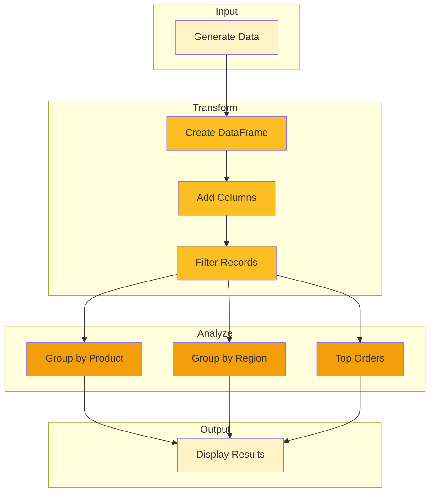
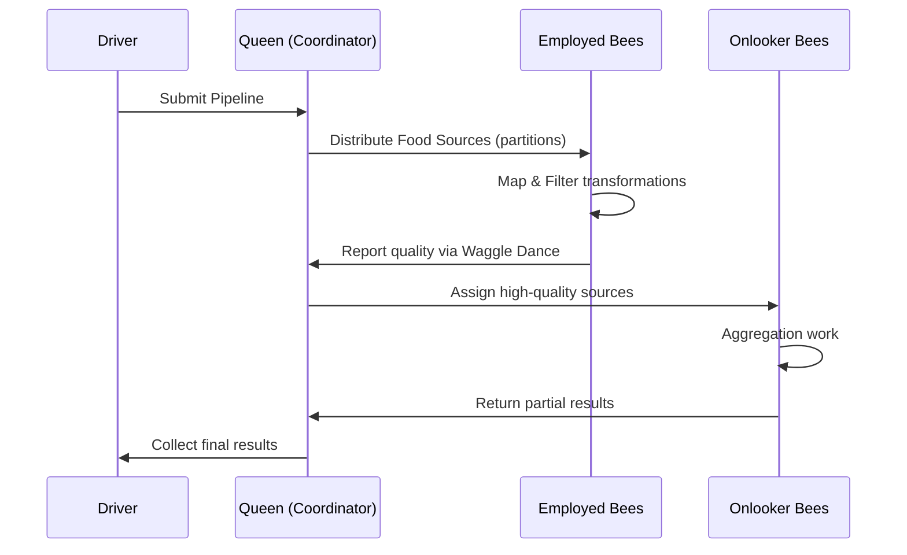

# Your First Pipeline

Build a complete data processing pipeline that reads, transforms, and writes data using HiveFrame's bee colony paradigm.

## What You'll Build

A pipeline that:
1. Generates sample sales data
2. Cleans and transforms the data
3. Calculates business metrics
4. Outputs results to the console

## Prerequisites

- [Getting Started](./getting-started) tutorial completed
- HiveFrame installed

## Step 1: Set Up the Project

Create a new directory and file:

```bash
mkdir hiveframe-pipeline
cd hiveframe-pipeline
touch pipeline.py
```

## Step 2: Create Sample Data

Add this code to `pipeline.py`:

```python
import hiveframe as hf
from datetime import datetime, timedelta
import random

# Sample sales data generator
def generate_sales_data(num_records: int) -> list[dict]:
    """Generate sample sales records."""
    products = ["Honey", "Beeswax", "Propolis", "Royal Jelly", "Pollen"]
    regions = ["North", "South", "East", "West"]
    
    data = []
    base_date = datetime(2026, 1, 1)
    
    for i in range(num_records):
        data.append({
            "id": i + 1,
            "date": (base_date + timedelta(days=random.randint(0, 30))).isoformat(),
            "product": random.choice(products),
            "region": random.choice(regions),
            "quantity": random.randint(1, 100),
            "unit_price": round(random.uniform(10.0, 100.0), 2),
            "customer_id": random.randint(1000, 9999),
        })
    
    return data

# Generate 1000 sales records
sales_data = generate_sales_data(1000)
print(f"Generated {len(sales_data)} sales records")
```

## Step 3: Create a DataFrame

Now let's load this data into a HiveFrame DataFrame:

```python
# Create a HiveFrame DataFrame from our data
df = hf.DataFrame(sales_data)

# View the schema
print("Schema:")
df.print_schema()

# Preview the data
print("\nFirst 5 rows:")
df.show(5)
```

Expected output:

```
Schema:
root
 |-- id: integer
 |-- date: string
 |-- product: string
 |-- region: string
 |-- quantity: integer
 |-- unit_price: double
 |-- customer_id: integer

First 5 rows:
+----+------------+---------+--------+----------+------------+-------------+
| id | date       | product | region | quantity | unit_price | customer_id |
+----+------------+---------+--------+----------+------------+-------------+
|  1 | 2026-01-15 | Honey   | North  |       42 |      35.99 |        1234 |
|  2 | 2026-01-08 | Beeswax | South  |       18 |      22.50 |        5678 |
...
```

## Step 4: Transform the Data

Add calculated columns and filter the data:

```python
# Add a total_amount column
df = df.with_column(
    "total_amount",
    hf.col("quantity") * hf.col("unit_price")
)

# Add a high_value flag for orders over $500
df = df.with_column(
    "high_value",
    hf.col("total_amount") > 500
)

# Filter out small orders (less than 5 items)
df = df.filter(hf.col("quantity") >= 5)

print(f"After filtering: {df.count()} records")
df.show(5)
```

## Step 5: Aggregate the Data

Calculate business metrics using groupBy:

```python
# Sales by product
print("\n📊 Sales by Product:")
by_product = df.groupBy("product").agg(
    hf.sum("quantity").alias("total_quantity"),
    hf.sum("total_amount").alias("total_revenue"),
    hf.avg("unit_price").alias("avg_price"),
    hf.count("id").alias("num_orders")
)
by_product.show()

# Sales by region
print("\n📊 Sales by Region:")
by_region = df.groupBy("region").agg(
    hf.sum("total_amount").alias("revenue"),
    hf.count("id").alias("orders")
).orderBy("revenue", ascending=False)
by_region.show()

# Top 5 high-value orders
print("\n🏆 Top 5 High-Value Orders:")
top_orders = df.filter(hf.col("high_value") == True) \
    .orderBy("total_amount", ascending=False) \
    .select("id", "product", "region", "total_amount") \
    .limit(5)
top_orders.show()
```

## Step 6: The Complete Pipeline

Here's the full `pipeline.py`:

```python
import hiveframe as hf
from datetime import datetime, timedelta
import random

def generate_sales_data(num_records: int) -> list[dict]:
    """Generate sample sales records."""
    products = ["Honey", "Beeswax", "Propolis", "Royal Jelly", "Pollen"]
    regions = ["North", "South", "East", "West"]
    
    data = []
    base_date = datetime(2026, 1, 1)
    
    for i in range(num_records):
        data.append({
            "id": i + 1,
            "date": (base_date + timedelta(days=random.randint(0, 30))).isoformat(),
            "product": random.choice(products),
            "region": random.choice(regions),
            "quantity": random.randint(1, 100),
            "unit_price": round(random.uniform(10.0, 100.0), 2),
            "customer_id": random.randint(1000, 9999),
        })
    
    return data

def main():
    print("🐝 HiveFrame Pipeline Demo\n")
    
    # Step 1: Generate data
    print("📁 Generating sample data...")
    sales_data = generate_sales_data(1000)
    
    # Step 2: Create DataFrame
    df = hf.DataFrame(sales_data)
    print(f"✅ Loaded {df.count()} records\n")
    
    # Step 3: Transform
    print("🔄 Transforming data...")
    df = df.with_column(
        "total_amount",
        hf.col("quantity") * hf.col("unit_price")
    ).with_column(
        "high_value",
        hf.col("total_amount") > 500
    ).filter(
        hf.col("quantity") >= 5
    )
    print(f"✅ After transformation: {df.count()} records\n")
    
    # Step 4: Analyze
    print("📊 Analyzing data...\n")
    
    print("Revenue by Product:")
    print("-" * 50)
    df.groupBy("product").agg(
        hf.sum("total_amount").alias("revenue"),
        hf.count("id").alias("orders")
    ).orderBy("revenue", ascending=False).show()
    
    print("\nRevenue by Region:")
    print("-" * 50)
    df.groupBy("region").agg(
        hf.sum("total_amount").alias("revenue"),
        hf.avg("total_amount").alias("avg_order")
    ).orderBy("revenue", ascending=False).show()
    
    print("\n🏆 Top 5 Orders:")
    print("-" * 50)
    df.orderBy("total_amount", ascending=False) \
        .select("id", "product", "region", "total_amount") \
        .limit(5) \
        .show()
    
    print("\n✅ Pipeline complete!")

if __name__ == "__main__":
    main()
```

## Step 7: Run the Pipeline

```bash
python pipeline.py
```

## Pipeline Architecture

Here's what's happening behind the scenes:



## How Bees Process This Pipeline



## What You Learned

- ✅ Creating DataFrames from Python data
- ✅ Adding computed columns with `with_column()`
- ✅ Filtering data with `filter()`
- ✅ Grouping and aggregating with `groupBy()` and `agg()`
- ✅ Sorting with `orderBy()`
- ✅ Selecting columns with `select()`
- ✅ Limiting results with `limit()`

## Next Steps

- [DataFrame Basics](./dataframe-basics) - Deep dive into DataFrame operations
- [Streaming Application](./streaming-application) - Process data in real-time
- [SQL Analytics](./sql-analytics) - Use SQL instead of DataFrame API

## Challenge

Try extending this pipeline to:

1. Add a "discount" column based on quantity (10% for qty > 50)
2. Calculate month-over-month growth
3. Find the top customer by total spend
4. Save results to a Parquet file (see [How-To: Read/Write Parquet](/docs/how-to/read-write-parquet))
