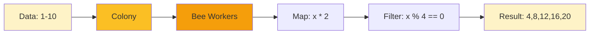

# Getting Started

Get HiveFrame installed and run your first bee-powered data processing code in under 5 minutes.

## Prerequisites

- Python 3.9 or higher
- pip (Python package manager)

## Step 1: Install HiveFrame

Open your terminal and install HiveFrame:

```bash
pip install hiveframe
```

For additional features, install optional dependencies:

```bash
# Kafka support
pip install hiveframe[kafka]

# PostgreSQL support
pip install hiveframe[postgres]

# Monitoring (Prometheus metrics)
pip install hiveframe[monitoring]

# All production features
pip install hiveframe[production]
```

## Step 2: Verify Installation

Create a file called `verify.py`:

```python
import hiveframe as hf

# Check version
print(f"HiveFrame version: {hf.__version__}")

# Create a simple colony
colony = hf.Colony(name="test-colony")
print(f"Colony created: {colony.name}")
```

Run it:

```bash
python verify.py
```

You should see output like:

```
HiveFrame version: 0.2.0
Colony created: test-colony
```

## Step 3: Your First Transformation

Let's process some data using the bee colony paradigm:

```python
import hiveframe as hf

# Create a colony (your processing cluster)
colony = hf.Colony(name="my-first-colony")

# Create some data
data = [1, 2, 3, 4, 5, 6, 7, 8, 9, 10]

# Distribute data to bee workers
food_source = colony.distribute(data)

# Process with map (bees transform the nectar)
doubled = food_source.map(lambda x: x * 2)

# Filter (bees select quality nectar)
evens = doubled.filter(lambda x: x % 4 == 0)

# Collect results back to the hive
result = evens.collect()
print(f"Result: {result}")  # [4, 8, 12, 16, 20]
```

## Step 4: Understanding the Output

When you run HiveFrame code, you'll see the bee colony in action:

```
🐝 Colony 'my-first-colony' initialized with 4 workers
🍯 Food source created with 10 items
🔄 Map transformation registered
🔍 Filter transformation registered
✅ Collected 5 items from hive
Result: [4, 8, 12, 16, 20]
```

## What Just Happened?



1. **Colony** - Your distributed processing cluster (like a beehive)
2. **Food Source** - Data distributed across workers (like nectar sources)
3. **Map** - Transformation applied by bee workers (processing nectar)
4. **Filter** - Quality selection (choosing the best nectar)
5. **Collect** - Gather results back to the driver (honey to the hive)

## Next Steps

Now that you have HiveFrame running, continue to:

- [Your First Pipeline](./first-pipeline) - Build a complete data processing pipeline
- [DataFrame Basics](./dataframe-basics) - Learn the powerful DataFrame API
- [Streaming Application](./streaming-application) - Process data in real-time

## Troubleshooting

### Import Error

If you see `ModuleNotFoundError: No module named 'hiveframe'`:

```bash
# Make sure you're using the right Python
python -m pip install hiveframe

# Or with a specific version
python3.11 -m pip install hiveframe
```

### Version Mismatch

Check your installed version:

```bash
pip show hiveframe
```

### Getting Help

- Check the [How-To Guides](/docs/how-to) for specific tasks
- Read [Core Concepts](/docs/explanation/architecture-overview) for deeper understanding
- Browse the [API Reference](/docs/reference/core) for technical details
