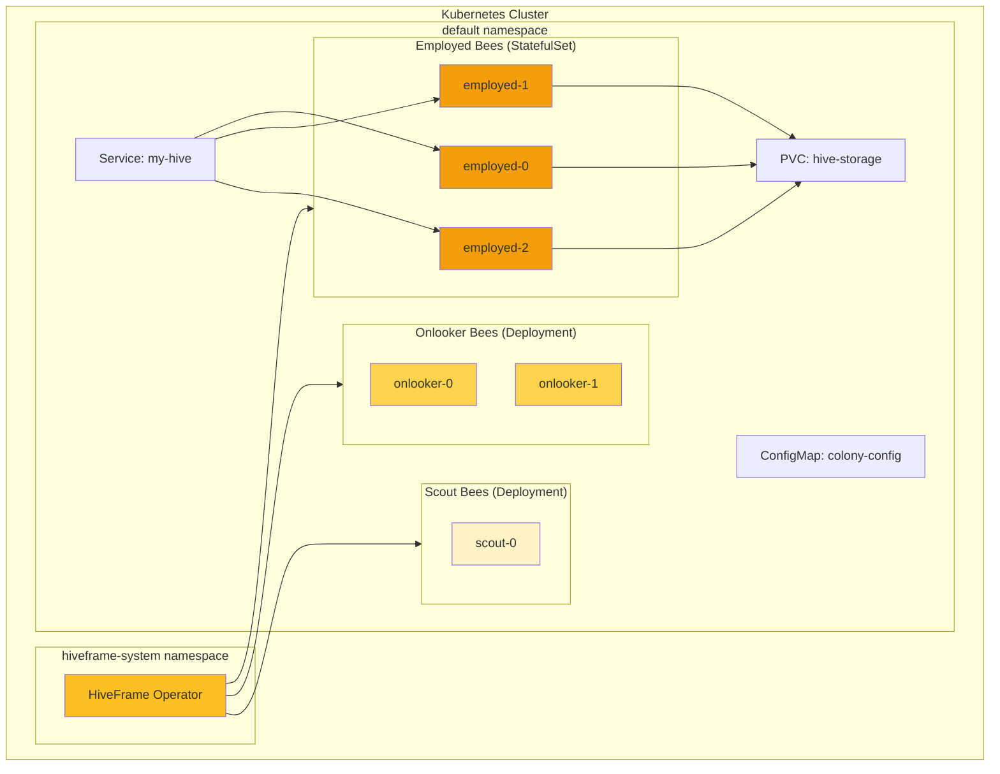

# Kubernetes Deployment

Deploy HiveFrame to a Kubernetes cluster for production workloads. Learn to use the HiveFrame Operator for automated scaling and management.

## What You'll Build

A production-ready HiveFrame deployment with:
1. HiveFrame Operator for lifecycle management
2. Auto-scaling based on workload
3. Monitoring and observability
4. High availability configuration

## Prerequisites

- [Getting Started](./getting-started) completed
- Kubernetes cluster (minikube, kind, or cloud provider)
- kubectl installed and configured
- Basic Kubernetes knowledge

## Step 1: Install the HiveFrame Operator

The Operator manages HiveFrame clusters on Kubernetes:

```bash
# Add the HiveFrame Helm repository
helm repo add hiveframe https://charts.hiveframe.io
helm repo update

# Install the operator
helm install hiveframe-operator hiveframe/operator \
  --namespace hiveframe-system \
  --create-namespace
```

Verify the installation:

```bash
kubectl get pods -n hiveframe-system
```

Expected output:

```
NAME                                  READY   STATUS    RESTARTS   AGE
hiveframe-operator-6d4f8b9c7d-xkj2m   1/1     Running   0          30s
```

## Step 2: Create a HiveFrame Cluster

Create a file `hiveframe-cluster.yaml`:

```yaml
apiVersion: hiveframe.io/v1
kind: HiveFrameCluster
metadata:
  name: my-hive
  namespace: default
spec:
  # Colony configuration
  colony:
    name: production-colony
    workers: 3
    
  # Worker bee configuration
  bees:
    employed:
      replicas: 3
      resources:
        requests:
          memory: "1Gi"
          cpu: "500m"
        limits:
          memory: "2Gi"
          cpu: "1000m"
    
    onlooker:
      replicas: 2
      resources:
        requests:
          memory: "512Mi"
          cpu: "250m"
    
    scout:
      replicas: 1
      resources:
        requests:
          memory: "256Mi"
          cpu: "100m"
  
  # Storage configuration
  storage:
    type: persistent
    size: 10Gi
    storageClass: standard
  
  # Monitoring
  monitoring:
    enabled: true
    prometheus:
      scrape: true
      port: 9090
```

Apply it:

```bash
kubectl apply -f hiveframe-cluster.yaml
```

## Step 3: Verify the Cluster

Check the cluster status:

```bash
kubectl get hiveframecluster my-hive
```

```
NAME      WORKERS   STATUS    AGE
my-hive   6         Running   2m
```

Check the pods:

```bash
kubectl get pods -l hiveframe.io/cluster=my-hive
```

```
NAME                           READY   STATUS    RESTARTS   AGE
my-hive-employed-0             1/1     Running   0          2m
my-hive-employed-1             1/1     Running   0          2m
my-hive-employed-2             1/1     Running   0          2m
my-hive-onlooker-0             1/1     Running   0          2m
my-hive-onlooker-1             1/1     Running   0          2m
my-hive-scout-0                1/1     Running   0          2m
```

## Architecture on Kubernetes



## Step 4: Submit a Job

### Using Python Client

```python
import hiveframe as hf
from hiveframe.k8s import K8sColony

# Connect to the K8s cluster
colony = K8sColony.connect(
    cluster_name="my-hive",
    namespace="default",
    kubeconfig="~/.kube/config"  # Optional: uses default if not specified
)

# Create a DataFrame
df = hf.DataFrame([
    {"id": 1, "value": 100},
    {"id": 2, "value": 200},
    {"id": 3, "value": 300},
])

# Process on the cluster
result = colony.process(
    df.filter(hf.col("value") > 150)
      .with_column("doubled", hf.col("value") * 2)
)

print(result.collect())
```

### Using kubectl

Create a job manifest `hiveframe-job.yaml`:

```yaml
apiVersion: hiveframe.io/v1
kind: HiveFrameJob
metadata:
  name: analytics-job
spec:
  cluster: my-hive
  
  # Python script to run
  script: |
    import hiveframe as hf
    
    # Read from object storage
    df = hf.read.parquet("s3://my-bucket/data/")
    
    # Process
    result = df.groupBy("category").agg(
        hf.sum("amount").alias("total")
    )
    
    # Write results
    result.write.parquet("s3://my-bucket/results/")
  
  # Job configuration
  config:
    parallelism: 3
    retries: 2
    timeout: 3600
```

Submit:

```bash
kubectl apply -f hiveframe-job.yaml
```

Monitor:

```bash
kubectl get hiveframejob analytics-job -w
```

## Step 5: Configure Auto-Scaling

Update the cluster to enable auto-scaling:

```yaml
apiVersion: hiveframe.io/v1
kind: HiveFrameCluster
metadata:
  name: my-hive
spec:
  colony:
    name: production-colony
  
  # Auto-scaling configuration
  autoscaling:
    enabled: true
    
    # Employed bees scale based on food source quality
    employed:
      minReplicas: 2
      maxReplicas: 10
      metrics:
        - type: Custom
          custom:
            metric:
              name: hiveframe_food_source_quality
            target:
              type: AverageValue
              averageValue: "0.7"
    
    # Onlooker bees scale based on waggle dance intensity
    onlooker:
      minReplicas: 1
      maxReplicas: 5
      metrics:
        - type: Custom
          custom:
            metric:
              name: hiveframe_waggle_intensity
            target:
              type: AverageValue
              averageValue: "100"
    
    # Scout bees stay fixed (exploration is constant)
    scout:
      minReplicas: 1
      maxReplicas: 2
```

## Step 6: Set Up Monitoring

### Prometheus ServiceMonitor

```yaml
apiVersion: monitoring.coreos.com/v1
kind: ServiceMonitor
metadata:
  name: hiveframe-metrics
  labels:
    app: hiveframe
spec:
  selector:
    matchLabels:
      hiveframe.io/cluster: my-hive
  endpoints:
    - port: metrics
      interval: 15s
      path: /metrics
```

### Grafana Dashboard

Import the HiveFrame dashboard:

```bash
kubectl apply -f https://raw.githubusercontent.com/hiveframe/hiveframe/main/deploy/grafana-dashboard.yaml
```

Key metrics to monitor:

| Metric | Description |
|--------|-------------|
| `hiveframe_colony_temperature` | System load (target: 35-38°C) |
| `hiveframe_food_source_quality` | Task quality scores |
| `hiveframe_waggle_dance_count` | Communication activity |
| `hiveframe_pheromone_level` | Backpressure indicator |
| `hiveframe_abandoned_sources` | Self-healing activity |

## Step 7: Production Hardening

### Resource Quotas

```yaml
apiVersion: v1
kind: ResourceQuota
metadata:
  name: hiveframe-quota
spec:
  hard:
    requests.cpu: "10"
    requests.memory: "20Gi"
    limits.cpu: "20"
    limits.memory: "40Gi"
    pods: "20"
```

### Network Policies

```yaml
apiVersion: networking.k8s.io/v1
kind: NetworkPolicy
metadata:
  name: hiveframe-network
spec:
  podSelector:
    matchLabels:
      hiveframe.io/cluster: my-hive
  policyTypes:
    - Ingress
    - Egress
  ingress:
    - from:
        - podSelector:
            matchLabels:
              hiveframe.io/cluster: my-hive
  egress:
    - to:
        - podSelector:
            matchLabels:
              hiveframe.io/cluster: my-hive
    - to:  # Allow external storage access
        - namespaceSelector: {}
      ports:
        - port: 443
```

### Pod Disruption Budget

```yaml
apiVersion: policy/v1
kind: PodDisruptionBudget
metadata:
  name: hiveframe-pdb
spec:
  minAvailable: 2
  selector:
    matchLabels:
      hiveframe.io/cluster: my-hive
      hiveframe.io/role: employed
```

## Step 8: Full Production Configuration

Here's a complete production-ready configuration:

```yaml
apiVersion: hiveframe.io/v1
kind: HiveFrameCluster
metadata:
  name: production-hive
  namespace: hiveframe
spec:
  colony:
    name: prod-colony
    
  # Worker configuration with anti-affinity
  bees:
    employed:
      replicas: 5
      resources:
        requests:
          memory: "4Gi"
          cpu: "2"
        limits:
          memory: "8Gi"
          cpu: "4"
      affinity:
        podAntiAffinity:
          requiredDuringSchedulingIgnoredDuringExecution:
            - labelSelector:
                matchLabels:
                  hiveframe.io/role: employed
              topologyKey: kubernetes.io/hostname
    
    onlooker:
      replicas: 3
      resources:
        requests:
          memory: "2Gi"
          cpu: "1"
    
    scout:
      replicas: 2
      resources:
        requests:
          memory: "1Gi"
          cpu: "500m"
  
  # High-availability storage
  storage:
    type: persistent
    size: 100Gi
    storageClass: fast-ssd
    replication: 3
  
  # Auto-scaling
  autoscaling:
    enabled: true
    employed:
      minReplicas: 3
      maxReplicas: 20
    onlooker:
      minReplicas: 2
      maxReplicas: 10
  
  # Monitoring and alerting
  monitoring:
    enabled: true
    prometheus:
      scrape: true
    alerting:
      enabled: true
      rules:
        - name: HighColonyTemperature
          condition: hiveframe_colony_temperature > 40
          severity: warning
        - name: LowFoodSourceQuality
          condition: hiveframe_food_source_quality < 0.3
          severity: critical
  
  # Security
  security:
    podSecurityContext:
      runAsNonRoot: true
      runAsUser: 1000
    networkPolicy:
      enabled: true
```

## Troubleshooting

### Check Operator Logs

```bash
kubectl logs -n hiveframe-system deployment/hiveframe-operator
```

### Check Worker Logs

```bash
kubectl logs -l hiveframe.io/cluster=my-hive,hiveframe.io/role=employed
```

### Debug a Pod

```bash
kubectl exec -it my-hive-employed-0 -- /bin/sh
```

### Common Issues

| Issue | Solution |
|-------|----------|
| Pods stuck in Pending | Check resource quotas and node capacity |
| Workers not communicating | Verify network policies |
| High latency | Check storage class performance |
| Jobs failing | Check worker logs for errors |

## What You Learned

- ✅ Installing the HiveFrame Operator
- ✅ Creating a HiveFrame cluster on Kubernetes
- ✅ Submitting jobs to the cluster
- ✅ Configuring auto-scaling
- ✅ Setting up monitoring
- ✅ Production hardening techniques

## Next Steps

- [How-To: Setup Monitoring](/docs/how-to/setup-monitoring) - Advanced monitoring
- [Explanation: Three-Tier Workers](/docs/explanation/three-tier-workers) - Understand worker types
- [Reference: Kubernetes](/docs/reference/kubernetes) - Complete K8s API reference

## Challenge

Try these production scenarios:

1. Set up a multi-zone deployment for high availability
2. Configure external secrets for S3/GCS credentials
3. Implement a blue-green deployment strategy
4. Set up log aggregation with Loki or Elasticsearch
