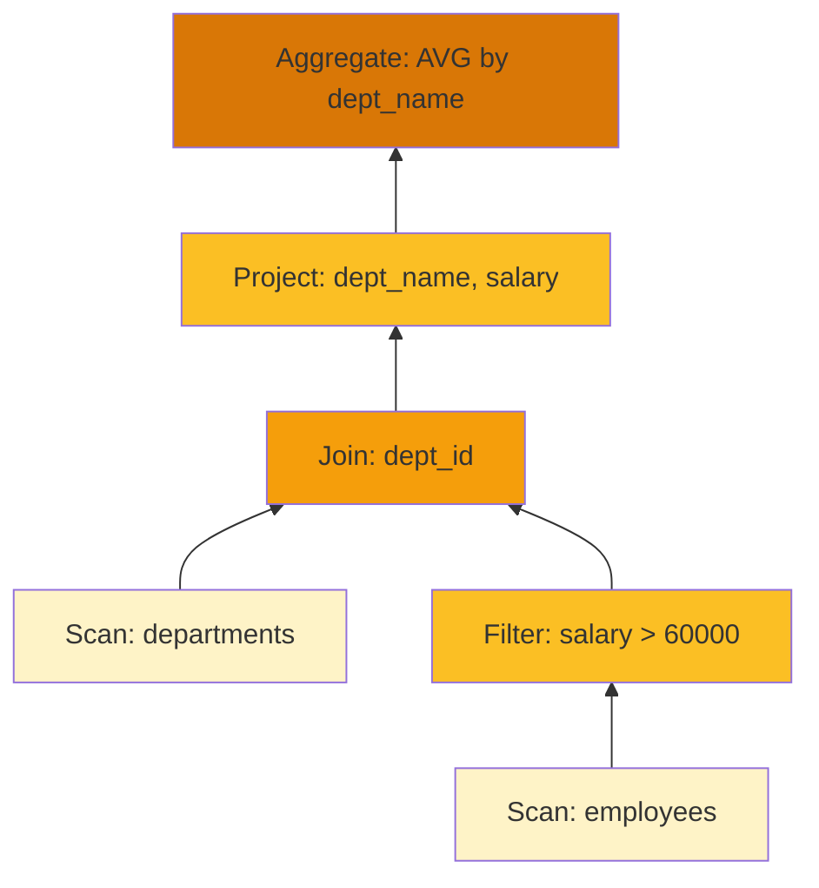

# SQL Analytics with SwarmQL

Learn to query data using HiveFrame's SQL engine - SwarmQL. Write familiar SQL syntax while benefiting from bee colony optimization.

## What You'll Learn

- Registering tables and creating a SQL context
- Writing SELECT, WHERE, GROUP BY queries
- Performing JOINs across tables
- Understanding query plans and optimization
- Using SQL with streaming data

## Prerequisites

- [DataFrame Basics](./dataframe-basics) completed
- Basic SQL knowledge

## Step 1: Create a SQL Context

```python
import hiveframe as hf
from hiveframe.sql import SQLContext

# Create the SQL context
sql = SQLContext()

# Create some sample data
employees = hf.DataFrame([
    {"id": 1, "name": "Alice", "dept_id": 10, "salary": 75000},
    {"id": 2, "name": "Bob", "dept_id": 20, "salary": 65000},
    {"id": 3, "name": "Carol", "dept_id": 10, "salary": 80000},
    {"id": 4, "name": "Dave", "dept_id": 20, "salary": 70000},
    {"id": 5, "name": "Eve", "dept_id": 30, "salary": 90000},
])

departments = hf.DataFrame([
    {"dept_id": 10, "dept_name": "Engineering", "location": "NYC"},
    {"dept_id": 20, "dept_name": "Marketing", "location": "LA"},
    {"dept_id": 30, "dept_name": "Executive", "location": "NYC"},
])

# Register DataFrames as tables
sql.register_table("employees", employees)
sql.register_table("departments", departments)

print("Tables registered:")
print(sql.list_tables())
```

## Step 2: Basic SELECT Queries

```python
# Select all columns
result = sql.execute("SELECT * FROM employees")
result.show()

# Select specific columns
result = sql.execute("""
    SELECT name, salary 
    FROM employees
""")
result.show()

# Computed columns
result = sql.execute("""
    SELECT 
        name,
        salary,
        salary * 0.3 AS tax,
        salary * 0.7 AS net_pay
    FROM employees
""")
result.show()
```

## Step 3: Filtering with WHERE

```python
# Simple filter
result = sql.execute("""
    SELECT * FROM employees
    WHERE salary > 70000
""")
result.show()

# Multiple conditions
result = sql.execute("""
    SELECT * FROM employees
    WHERE salary > 65000 
      AND dept_id = 10
""")
result.show()

# IN clause
result = sql.execute("""
    SELECT * FROM employees
    WHERE dept_id IN (10, 20)
""")
result.show()

# BETWEEN
result = sql.execute("""
    SELECT * FROM employees
    WHERE salary BETWEEN 65000 AND 80000
""")
result.show()

# LIKE pattern matching
result = sql.execute("""
    SELECT * FROM employees
    WHERE name LIKE 'A%'
""")
result.show()
```

## Step 4: Aggregations and GROUP BY

```python
# Count all
result = sql.execute("""
    SELECT COUNT(*) as total_employees
    FROM employees
""")
result.show()

# Group by department
result = sql.execute("""
    SELECT 
        dept_id,
        COUNT(*) as num_employees,
        AVG(salary) as avg_salary,
        MIN(salary) as min_salary,
        MAX(salary) as max_salary,
        SUM(salary) as total_payroll
    FROM employees
    GROUP BY dept_id
""")
result.show()

# HAVING clause
result = sql.execute("""
    SELECT 
        dept_id,
        AVG(salary) as avg_salary
    FROM employees
    GROUP BY dept_id
    HAVING AVG(salary) > 70000
""")
result.show()
```

## Step 5: Sorting and Limiting

```python
# Order by
result = sql.execute("""
    SELECT * FROM employees
    ORDER BY salary DESC
""")
result.show()

# Multiple sort columns
result = sql.execute("""
    SELECT * FROM employees
    ORDER BY dept_id ASC, salary DESC
""")
result.show()

# Limit results
result = sql.execute("""
    SELECT * FROM employees
    ORDER BY salary DESC
    LIMIT 3
""")
result.show()
```

## Step 6: JOIN Operations

```python
# INNER JOIN
result = sql.execute("""
    SELECT 
        e.name,
        e.salary,
        d.dept_name,
        d.location
    FROM employees e
    INNER JOIN departments d ON e.dept_id = d.dept_id
""")
result.show()

# LEFT JOIN
result = sql.execute("""
    SELECT 
        e.name,
        e.salary,
        d.dept_name
    FROM employees e
    LEFT JOIN departments d ON e.dept_id = d.dept_id
""")
result.show()

# Multiple JOINs
result = sql.execute("""
    SELECT 
        e.name,
        d.dept_name,
        COUNT(*) as colleagues
    FROM employees e
    JOIN departments d ON e.dept_id = d.dept_id
    JOIN employees e2 ON e.dept_id = e2.dept_id AND e.id != e2.id
    GROUP BY e.name, d.dept_name
""")
result.show()
```

## Step 7: Subqueries

```python
# Subquery in WHERE
result = sql.execute("""
    SELECT * FROM employees
    WHERE salary > (SELECT AVG(salary) FROM employees)
""")
result.show()

# Subquery in FROM
result = sql.execute("""
    SELECT dept_id, avg_salary
    FROM (
        SELECT dept_id, AVG(salary) as avg_salary
        FROM employees
        GROUP BY dept_id
    ) dept_stats
    WHERE avg_salary > 70000
""")
result.show()
```

## Step 8: Understand Query Plans

SwarmQL uses the ABC (Artificial Bee Colony) algorithm for query optimization:

```python
# Explain a query plan
plan = sql.explain("""
    SELECT 
        d.dept_name,
        AVG(e.salary) as avg_salary
    FROM employees e
    JOIN departments d ON e.dept_id = d.dept_id
    WHERE e.salary > 60000
    GROUP BY d.dept_name
""")
print(plan)
```

Output:

```
== Physical Plan ==
Aggregate [dept_name], [avg(salary)]
  +- Project [dept_name, salary]
       +- Join [dept_id = dept_id] (INNER)
            +- Filter [salary > 60000]
            |    +- Scan [employees]
            +- Scan [departments]

== Optimizations Applied ==
✓ Predicate Pushdown: salary > 60000 pushed to scan
✓ Column Pruning: Selected only required columns
✓ Join Reorder: Smaller table (departments) on build side

== Estimated Cost ==
Rows: ~4
Cost: 0.42 (ABC fitness score)
```



## Step 9: SQL with Streaming

Use SQL on streaming data:

```python
from hiveframe.streaming import StreamProcessor, StreamConfig
from hiveframe.sql import SQLContext

# Create streaming SQL context
sql = SQLContext(streaming=True)

# Register a streaming source as a table
stream = StreamProcessor(StreamConfig(name="events"))
sql.register_stream("events", stream)

# Query with tumbling window
result = sql.execute("""
    SELECT 
        sensor_id,
        AVG(temperature) as avg_temp,
        window_start,
        window_end
    FROM events
    GROUP BY 
        sensor_id,
        TUMBLE(timestamp, INTERVAL '1' MINUTE)
""")

# Start the streaming query
result.start()
```

## Complete SQL Analytics Example

```python
import hiveframe as hf
from hiveframe.sql import SQLContext

def main():
    print("🐝 SwarmQL Analytics Demo\n")
    
    # Initialize SQL context
    sql = SQLContext()
    
    # Create sample sales data
    sales = hf.DataFrame([
        {"order_id": 1, "product": "Laptop", "region": "North", "amount": 1200, "date": "2026-01-15"},
        {"order_id": 2, "product": "Mouse", "region": "South", "amount": 25, "date": "2026-01-15"},
        {"order_id": 3, "product": "Keyboard", "region": "North", "amount": 75, "date": "2026-01-16"},
        {"order_id": 4, "product": "Monitor", "region": "East", "amount": 350, "date": "2026-01-16"},
        {"order_id": 5, "product": "Laptop", "region": "West", "amount": 1200, "date": "2026-01-17"},
        {"order_id": 6, "product": "Headphones", "region": "South", "amount": 150, "date": "2026-01-17"},
        {"order_id": 7, "product": "Laptop", "region": "North", "amount": 1200, "date": "2026-01-18"},
        {"order_id": 8, "product": "Mouse", "region": "East", "amount": 25, "date": "2026-01-18"},
    ])
    
    products = hf.DataFrame([
        {"product": "Laptop", "category": "Computers", "cost": 800},
        {"product": "Mouse", "category": "Accessories", "cost": 10},
        {"product": "Keyboard", "category": "Accessories", "cost": 30},
        {"product": "Monitor", "category": "Computers", "cost": 200},
        {"product": "Headphones", "category": "Audio", "cost": 60},
    ])
    
    sql.register_table("sales", sales)
    sql.register_table("products", products)
    
    # Query 1: Sales by region
    print("📊 Sales by Region:")
    print("-" * 50)
    result = sql.execute("""
        SELECT 
            region,
            COUNT(*) as num_orders,
            SUM(amount) as total_revenue
        FROM sales
        GROUP BY region
        ORDER BY total_revenue DESC
    """)
    result.show()
    
    # Query 2: Product performance with profit
    print("\n📊 Product Performance:")
    print("-" * 50)
    result = sql.execute("""
        SELECT 
            s.product,
            p.category,
            COUNT(*) as units_sold,
            SUM(s.amount) as revenue,
            SUM(s.amount - p.cost) as profit,
            ROUND(AVG(s.amount - p.cost), 2) as avg_profit_per_sale
        FROM sales s
        JOIN products p ON s.product = p.product
        GROUP BY s.product, p.category
        ORDER BY profit DESC
    """)
    result.show()
    
    # Query 3: Daily trend
    print("\n📊 Daily Sales Trend:")
    print("-" * 50)
    result = sql.execute("""
        SELECT 
            date,
            COUNT(*) as orders,
            SUM(amount) as revenue,
            AVG(amount) as avg_order_value
        FROM sales
        GROUP BY date
        ORDER BY date
    """)
    result.show()
    
    # Query 4: Top products (subquery)
    print("\n🏆 Products Above Average Revenue:")
    print("-" * 50)
    result = sql.execute("""
        SELECT product, total_revenue
        FROM (
            SELECT 
                product,
                SUM(amount) as total_revenue
            FROM sales
            GROUP BY product
        )
        WHERE total_revenue > (
            SELECT AVG(amount) * 2 FROM sales
        )
        ORDER BY total_revenue DESC
    """)
    result.show()
    
    print("\n✅ Analysis complete!")

if __name__ == "__main__":
    main()
```

## SQL Reference

### Supported Statements

| Statement | Example |
|-----------|---------|
| SELECT | `SELECT col1, col2 FROM table` |
| WHERE | `WHERE col > 10 AND col2 = 'x'` |
| GROUP BY | `GROUP BY col1, col2` |
| HAVING | `HAVING COUNT(*) > 5` |
| ORDER BY | `ORDER BY col DESC` |
| LIMIT | `LIMIT 100` |
| JOIN | `JOIN t2 ON t1.id = t2.id` |

### Aggregate Functions

| Function | Description |
|----------|-------------|
| `COUNT(*)` | Count all rows |
| `COUNT(col)` | Count non-null values |
| `SUM(col)` | Sum of values |
| `AVG(col)` | Average value |
| `MIN(col)` | Minimum value |
| `MAX(col)` | Maximum value |
| `STDDEV(col)` | Standard deviation |

### Operators

| Operator | Example |
|----------|---------|
| Comparison | `=`, `!=`, `<`, `>`, `<=`, `>=` |
| Logical | `AND`, `OR`, `NOT` |
| Pattern | `LIKE 'pattern%'` |
| Range | `BETWEEN x AND y` |
| Set | `IN (a, b, c)` |
| Null | `IS NULL`, `IS NOT NULL` |

## What You Learned

- ✅ Creating SQL contexts and registering tables
- ✅ Writing SELECT, WHERE, GROUP BY queries
- ✅ Performing aggregations
- ✅ Joining multiple tables
- ✅ Using subqueries
- ✅ Understanding query plans

## Next Steps

- [Kubernetes Deployment](./kubernetes-deployment) - Deploy to production
- [Explanation: ABC Optimization](/docs/explanation/abc-optimization) - How queries are optimized
- [Reference: SQL](/docs/reference/sql) - Complete SQL reference

## Challenge

Write SQL queries to:

1. Find the top 3 selling products in each region
2. Calculate week-over-week growth
3. Identify customers with above-average order values
4. Create a pivot table of sales by product and region
