# Building a Streaming Application

Learn to build real-time data processing applications with HiveFrame's streaming API. Process unbounded data streams with windows, watermarks, and delivery guarantees.

## What You'll Build

A real-time analytics system that:
1. Ingests streaming events
2. Applies windowed aggregations
3. Handles late-arriving data
4. Guarantees exactly-once processing

## Prerequisites

- [DataFrame Basics](./dataframe-basics) completed
- Understanding of event-driven systems (helpful)

## Step 1: Understanding Streams vs Batches


**Batch**: Process all data at once, get one result.
**Stream**: Process data as it arrives, continuously produce results.

## Step 2: Create a Basic Stream

```python
import hiveframe as hf
from hiveframe.streaming import StreamProcessor, StreamConfig

# Create stream configuration
config = StreamConfig(
    name="my-first-stream",
    batch_interval_ms=1000,  # Process every 1 second
)

# Create the stream processor
stream = StreamProcessor(config)

# Define the processing logic
async def process_event(event: dict) -> dict:
    """Transform each event."""
    return {
        **event,
        "processed_at": hf.current_timestamp(),
        "value_doubled": event.get("value", 0) * 2,
    }

# Register the processor
stream.map(process_event)
```

## Step 3: Add Event Source

Let's create a source that generates events:

```python
from hiveframe.streaming import StreamSource
import asyncio
import random

# Create a custom source that generates events
class SensorSource(StreamSource):
    """Simulates IoT sensor readings."""
    
    def __init__(self, sensor_ids: list[str]):
        self.sensor_ids = sensor_ids
        self.running = False
    
    async def start(self):
        self.running = True
        while self.running:
            # Generate a random sensor reading
            event = {
                "sensor_id": random.choice(self.sensor_ids),
                "temperature": round(random.uniform(20.0, 30.0), 2),
                "humidity": round(random.uniform(40.0, 80.0), 2),
                "timestamp": hf.current_timestamp(),
            }
            yield event
            await asyncio.sleep(0.1)  # 10 events per second
    
    async def stop(self):
        self.running = False

# Create and attach the source
source = SensorSource(["sensor-1", "sensor-2", "sensor-3"])
stream.from_source(source)
```

## Step 4: Add Windowed Aggregations

Windows group events by time for aggregation:

```python
from hiveframe.streaming import TumblingWindow, SlidingWindow

# Tumbling window: Non-overlapping, fixed-size windows
# Every 10 seconds, calculate average temperature per sensor
stream.window(
    TumblingWindow(duration_seconds=10)
).groupBy("sensor_id").agg(
    hf.avg("temperature").alias("avg_temp"),
    hf.avg("humidity").alias("avg_humidity"),
    hf.count("*").alias("reading_count")
)
```

### Window Types


```python
# Sliding window: Overlapping windows
# Update every 5 seconds, looking at last 10 seconds
from hiveframe.streaming import SlidingWindow

stream.window(
    SlidingWindow(
        duration_seconds=10,
        slide_seconds=5
    )
).groupBy("sensor_id").agg(...)

# Session window: Dynamic based on activity gaps
from hiveframe.streaming import SessionWindow

stream.window(
    SessionWindow(gap_seconds=5)  # New session after 5s of inactivity
).groupBy("sensor_id").agg(...)
```

## Step 5: Handle Late Data with Watermarks

Real-world data arrives late. Watermarks define how long to wait:

```python
from hiveframe.streaming import Watermark

# Configure watermark: tolerate up to 30 seconds of lateness
stream.with_watermark(
    Watermark(
        event_time_column="timestamp",
        delay_threshold_seconds=30
    )
)
```



```mermaid
sequenceDiagram
    participant E as Events
    participant W as Watermark
    participant P as Processor
    
    Note over W: Watermark = Event Time - 30s
    
    E->>P: Event (t=100)
    W->>W: Update to t=70
    E->>P: Event (t=95) ✓ Accepted
    E->>P: Event (t=60) ✗ Too late!
    E->>P: Event (t=110)
    W->>W: Update to t=80
```

## Step 6: Delivery Guarantees

Choose your processing guarantee:

```python
from hiveframe.streaming import DeliveryGuarantee

# At-most-once: Fast but may lose data
config = StreamConfig(
    delivery=DeliveryGuarantee.AT_MOST_ONCE
)

# At-least-once: May duplicate, won't lose
config = StreamConfig(
    delivery=DeliveryGuarantee.AT_LEAST_ONCE
)

# Exactly-once: Strongest guarantee (requires checkpointing)
config = StreamConfig(
    delivery=DeliveryGuarantee.EXACTLY_ONCE,
    checkpoint_dir="/tmp/checkpoints",
    checkpoint_interval_ms=5000
)
```

| Guarantee | Latency | Data Loss | Duplicates | Use Case |
|-----------|---------|-----------|------------|----------|
| At-most-once | Lowest | Possible | No | Metrics, non-critical |
| At-least-once | Medium | No | Possible | Most applications |
| Exactly-once | Highest | No | No | Financial, critical |

## Step 7: Add a Sink

Output processed data to a destination:

```python
from hiveframe.streaming import ConsoleSink, KafkaSink

# Console sink for debugging
stream.to_sink(ConsoleSink())

# Kafka sink for production
stream.to_sink(KafkaSink(
    bootstrap_servers="localhost:9092",
    topic="processed-events"
))
```

## Step 8: Complete Streaming Application

Here's the full application:

```python
import hiveframe as hf
from hiveframe.streaming import (
    StreamProcessor,
    StreamConfig,
    TumblingWindow,
    Watermark,
    DeliveryGuarantee,
    ConsoleSink,
)
import asyncio
import random
from datetime import datetime

# Configuration
config = StreamConfig(
    name="iot-sensor-analytics",
    batch_interval_ms=1000,
    delivery=DeliveryGuarantee.AT_LEAST_ONCE,
)

# Create processor
stream = StreamProcessor(config)

# Simulated event generator
async def generate_events():
    """Generate simulated sensor events."""
    sensors = ["sensor-1", "sensor-2", "sensor-3"]
    
    while True:
        event = {
            "sensor_id": random.choice(sensors),
            "temperature": round(random.uniform(18.0, 32.0), 2),
            "humidity": round(random.uniform(30.0, 90.0), 2),
            "timestamp": datetime.now().isoformat(),
        }
        await stream.emit(event)
        await asyncio.sleep(0.1)

# Processing pipeline
(
    stream
    # Add watermark for late data handling
    .with_watermark(
        Watermark(
            event_time_column="timestamp",
            delay_threshold_seconds=10
        )
    )
    # Add alert flag for high temperatures
    .map(lambda e: {
        **e,
        "alert": e["temperature"] > 28.0
    })
    # 30-second tumbling windows
    .window(TumblingWindow(duration_seconds=30))
    # Aggregate by sensor
    .groupBy("sensor_id")
    .agg(
        hf.avg("temperature").alias("avg_temp"),
        hf.max("temperature").alias("max_temp"),
        hf.min("temperature").alias("min_temp"),
        hf.avg("humidity").alias("avg_humidity"),
        hf.sum(hf.when(hf.col("alert"), 1).otherwise(0)).alias("alert_count"),
        hf.count("*").alias("reading_count"),
    )
    # Output to console
    .to_sink(ConsoleSink(
        format="table",
        show_timestamp=True
    ))
)

async def main():
    print("🐝 Starting IoT Sensor Analytics Stream...")
    print("=" * 60)
    
    # Start the stream processor
    processor_task = asyncio.create_task(stream.start())
    
    # Start generating events
    generator_task = asyncio.create_task(generate_events())
    
    try:
        # Run for 2 minutes
        await asyncio.sleep(120)
    except KeyboardInterrupt:
        print("\n⏹️ Stopping stream...")
    finally:
        await stream.stop()
        generator_task.cancel()
    
    print("✅ Stream stopped")

if __name__ == "__main__":
    asyncio.run(main())
```

## Step 9: Run the Application

```bash
python streaming_app.py
```

Expected output:

```
🐝 Starting IoT Sensor Analytics Stream...
============================================================
[2026-01-30 10:00:30] Window Results:
+-----------+----------+----------+----------+--------------+-------------+---------------+
| sensor_id | avg_temp | max_temp | min_temp | avg_humidity | alert_count | reading_count |
+-----------+----------+----------+----------+--------------+-------------+---------------+
| sensor-1  |    24.53 |    31.20 |    19.10 |        58.42 |           8 |            98 |
| sensor-2  |    25.12 |    30.85 |    18.95 |        61.23 |          12 |           103 |
| sensor-3  |    23.89 |    29.50 |    19.45 |        55.67 |           5 |            99 |
+-----------+----------+----------+----------+--------------+-------------+---------------+
```

## Stream Processing Architecture

```mermaid
flowchart TB
    subgraph Sources["📥 Sources"]
        S1[Kafka]
        S2[HTTP]
        S3[Custom]
    end
    
    subgraph Processing["🔄 Stream Processor"]
        direction TB
        W[Watermark Handler]
        T[Transformations]
        WI[Window Manager]
        A[Aggregator]
        C[Checkpoint Manager]
    end
    
    subgraph Sinks["📤 Sinks"]
        K1[Kafka]
        K2[Console]
        K3[Database]
    end
    
    S1 --> W
    S2 --> W
    S3 --> W
    W --> T
    T --> WI
    WI --> A
    A --> K1
    A --> K2
    A --> K3
    C -.-> W
    C -.-> WI
    
    style W fill:#fef3c7
    style T fill:#fbbf24
    style WI fill:#f59e0b
    style A fill:#d97706
```



## What You Learned

- ✅ Creating stream processors
- ✅ Processing continuous event streams
- ✅ Using tumbling, sliding, and session windows
- ✅ Handling late data with watermarks
- ✅ Configuring delivery guarantees
- ✅ Connecting sources and sinks

## Next Steps

- [SQL Analytics](./sql-analytics) - Query streams with SQL
- [How-To: Configure Windows](/docs/how-to/configure-windows) - Advanced windowing
- [How-To: Delivery Guarantees](/docs/how-to/delivery-guarantees) - Production setup
- [Explanation: Streaming Windows](/docs/explanation/streaming-windows-watermarks) - Deep dive

## Challenge

Extend the streaming application to:

1. Add a sliding window that computes moving averages
2. Implement a high-temperature alert that fires immediately (not windowed)
3. Add a Dead Letter Queue for malformed events
4. Write results to a Parquet file every minute
